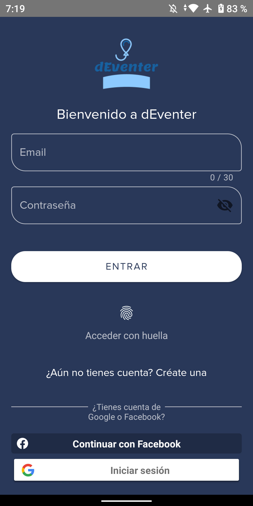
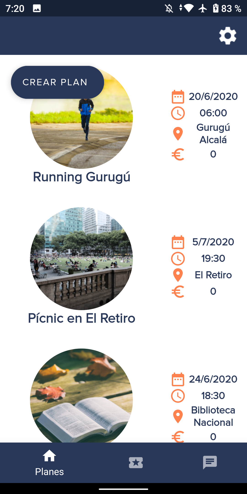
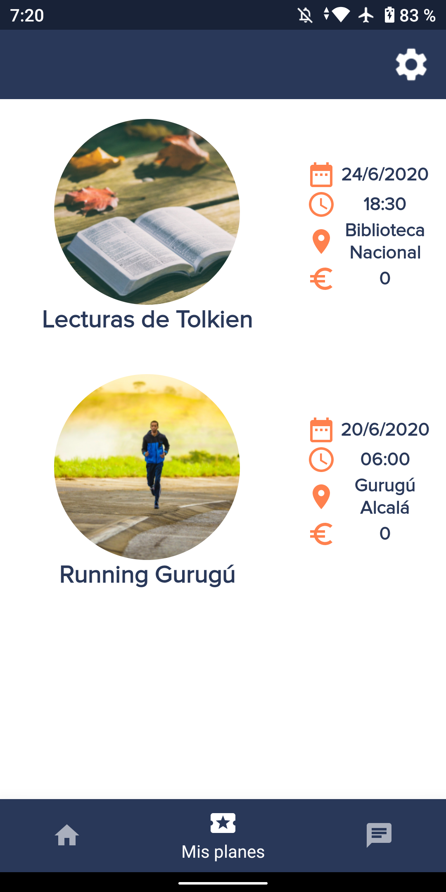
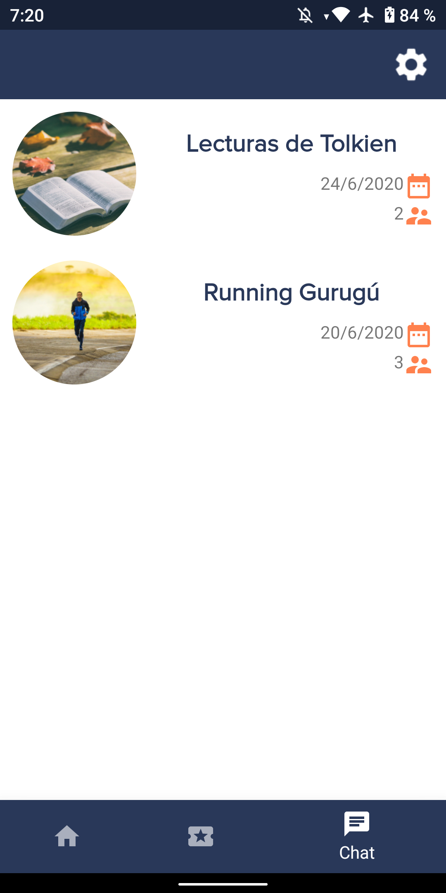
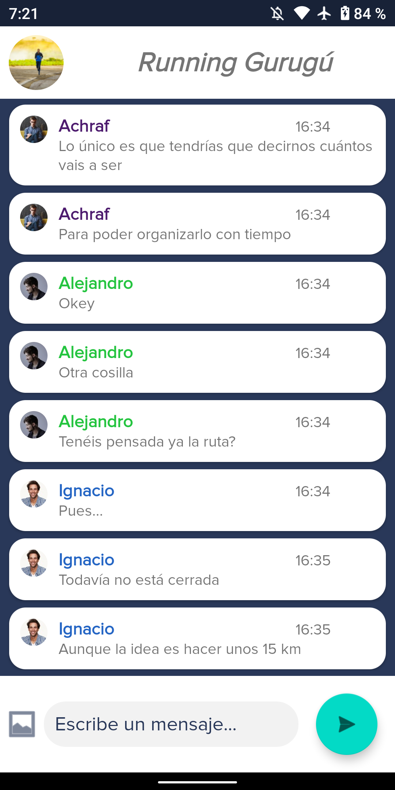
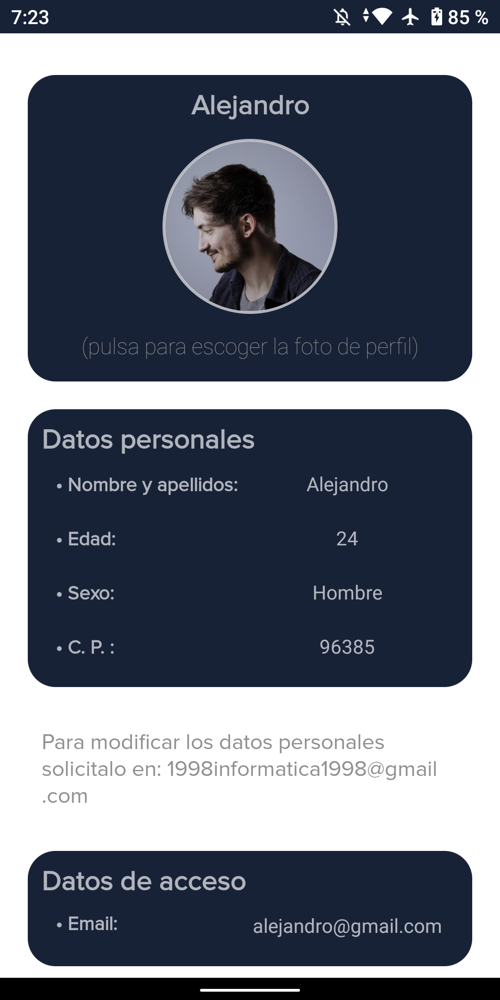

<p align="center">
	<br>
</p>
<p align="center">
	<a href="#features">Features</a> •
		<a href="/docs">Docs</a> •
	<a href="#instalación">Instalación</a> •
	<a href="user_guide.md">User Guide</a> •
	<a href="#roadmap">Roadmap</a> •
	<a href="#license">License</a>
</p>

Queda con amigos o conoce gente nueva haciendo los planes que más te gustan. Cañas, cenas, copas, quedadas, partidos de fútbol... Todo plan es bienvenido, ¡crea uno o únete a los que más te gusten!

dEventer es una aplicación Android que estamos desarrollando para el módulo de Proyecto del Ciclo Formativo de Grado Superior en Desarrollo de Aplicaciones Multiplataforma.

## Features

<p align="center">
	<table>
		<tr>
			<td><p align="center"><b>Inicia sesión</b></p>
			<td><p align="center"><b>Mira los planes disponibles</b></p>
			<td><p align="center"><b>Mira tus planes</b></p>
		</tr>
		<tr>
			<td></td>
			<td></td>
			<td></td>
		</tr>
		<tr>
			<td><p align="center"><b>Mira los <i>chats</b></p>
			<td><p align="center"><b><i>Chatea</i></b></p>
			<td><p align="center"><b>Cambia tu imagen de perfil</b></p>
		</tr>
		<tr>
			<td></td>
			<td></td>
			<td></td>
		</tr>
	</table>
</p>

## Instalación

Actualmente, al encontrarse al comienzo del desarrollo, la _app_ no está disponible para su descarga en ninguna _store_.

Puedes probarla —lo desarrollado hasta la fecha— clonando el repositorio y haciendo uso de Android Studio para compilar las fuentes e instalarlas en un emulador o dispositivo real.

```
# Clonar repositorio
$ git clone https://github.com/aaesalamanca/d-eventer.git
```

Ten en cuenta también que deberás configurar un proyecto en [Firebase](https://firebase.google.com) para poder hacer uso de las funciones _cloud_. El repositorio no incluye el archivo `google-services.json` y sin este, ni el proyecto en Firebase, no funciona.

## Roadmap

## Colaborar

Si quieres participar en el proyecto, te pedimos, por favor, que leas antes esta [guía para colaborar en dEventer](CONTRIBUTING.md).

## License

[Apache License, Version 2.0](https://www.apache.org/licenses/LICENSE-2.0)

---

Este `README.md` está basado en las indicaciones de [About READMEs](https://help.github.com/en/github/creating-cloning-and-archiving-repositories/about-readmes), [Make a README](https://www.makeareadme.com), [Awesome README](https://github.com/matiassingers/awesome-readme) y [Making READMEs readable](https://github.com/18F/open-source-guide/blob/18f-pages/pages/making-readmes-readable.md).
