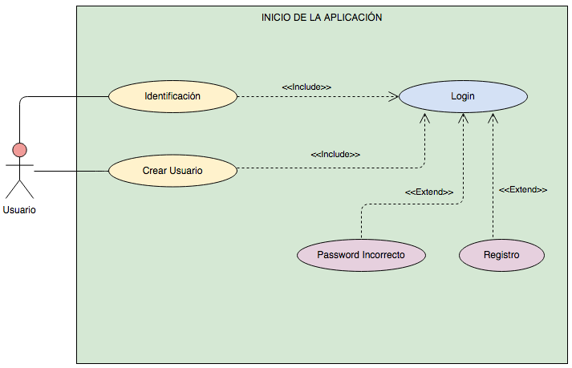
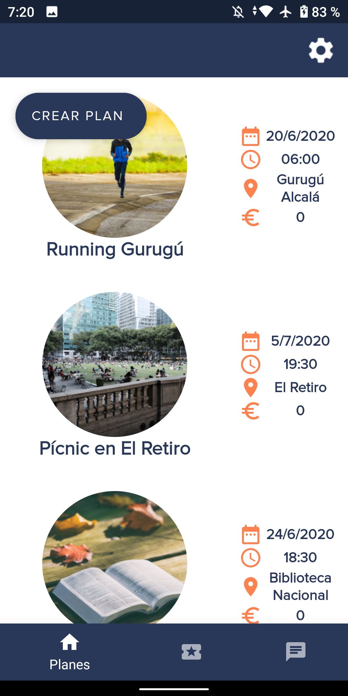
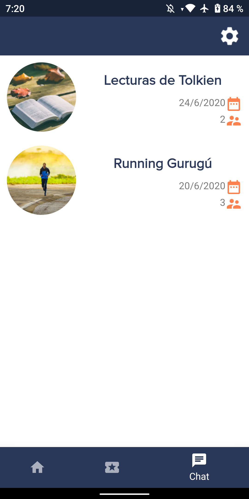
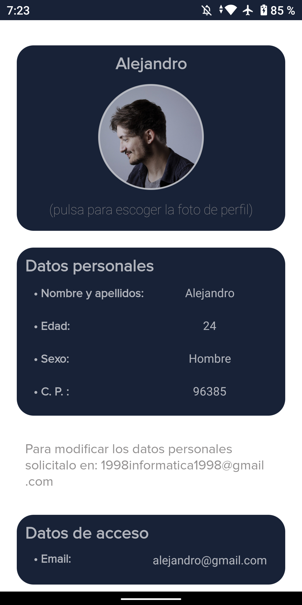
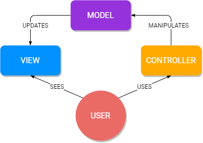
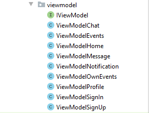
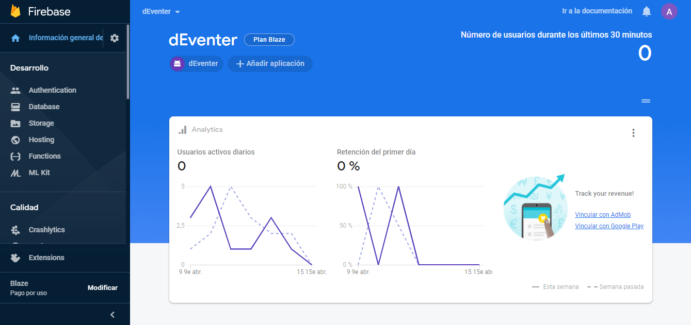
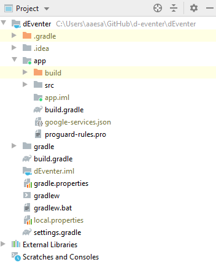

<h1 align="center">
	
</h1>

**Realizado por:**

* Martín Escamilla, José Ignacio
* Ahamad, Achraf
* Estornell Salamanca, Alejandro Antonio

## Índice

1. [Objetivos del proyecto](#objetivos-del-proyecto)
2. [Requisitos](#requisitos)
   1. [Casos de uso](#casos-de-uso)
3. [Aspecto visual](#aspecto-visual)
4. [Tech Stack](#tech-stack)
   1. [Firebase](#firebase)
      1. [Firebase Authentication](#firebase-authentication)
      2. [Firebase Realtime Database](#firebase-realtime-database)
      3. [Cloud Storage](#cloud-storage)
      4. [Firebase Cloud Messaging](#firebase-cloud-messaging)
      5. [Cloud Functions](#cloud-functions)
   2. [Java](#java)
   3. [Android](#android)
   4. [Material Design](#material-design)
   5. [Otros](#otros)
      1. [Google Maps Platform](#google-maps-platform)
      2. [JavaScript](#javascript)
      3. [Node.js](#nodejs)
      4. [Markdown](#markdown)
      5. [Pandoc y wkhtmltopdf](#pandoc-y-wkhtmltopdf)
      6. [Git y GitHub](#git-y-github)
      7. [Diagrams](#diagrams)
      8. [Android Studio](#android-studio)
      9. [Visual Studio Code](#visual-studio-code)
5. [Modelo de datos](#modelo-de-datos)
6. [Cloud Architecture](#arquitectura-de-software)
7. [Arquitectura de Software](#arquitectura-de-software)
   1. [MVC](#mvc)
   2. [MVP](#mvp)
   3. [MVVM](#mvvm)
   4. [Propuesta final](#propuesta-final)
8. [Firebase Setup](#firebase-setup)
   1. [Empezar con Firebase](#empezar-con-firebase)
      1. [Crear el proyecto en Firebase](#crear-el-proyecto-en-firebase)
      2. [Registrar app en Firebase](#registrar-app-en-firebase)
      3. [Google Services](#google-services)
      4. [SDK de Firebase](#sdk-de-firebase)
   2. [Firebase Authentication Setup](#firebase-authentication-setup)
   3. [Firebase Realtime Database Setup](#firebase-realtime-database-setup)
   4. [Cloud Storage Setup](#cloud-storage-setup)
   5. [Firebase Cloud Messaging Setup](#firebase-cloud-messaging-setup)
   6. [Cloud Functions Setup](#cloud-functions-setup)
9. [Mejoras](#mejoras)

## Objetivos del proyecto

El objetivo y reto principal, creemos, al que nos vamos a enfrentar es el diseño y desarrollo de una base de datos NoSQL en la nube que, además, no necesite de una capa intermedia o _web service_ entre la aplicación y esta. Su dificultad no reside tanto en el funcionamiento intrínseco de esta modalidad de almacenamiento de datos, sino en la curva de aprendizaje asociada, pues hemos trabajado poco con este tipo de tecnologías.

Los usuarios crearán una cuenta —con correo electrónico y contraseña—, iniciarán sesión con esta, o con un proveedor externo como Google, y, a partir de ahí podrán, como hemos señalado con anterioridad, visualizar el listado de planes disponibles para ellos —si la actividad no tiene límite de participantes o no lo ha alcanzado si lo tiene— e inscribirse en uno.

Junto al listado previo, dispondrá de otro compuesto por los planes a los que ya se ha apuntado o en los que ya ha participado.

Finalmente, y esto constituye el otro gran reto de recurrir a una base de datos NoSQL _cloud_, para cada actividad hay asociado un _chat_ en el que los usuarios inscritos pueden ir hablando antes, durante y tras la realización del plan propuesto. ¿Qué implicaciones tiene este _chat_? La base de datos y la aplicación deben sincronizarse en tiempo real. Más adelante explicaremos cómo hemos sorteado esta dificultad gracias, en gran parte, a las tecnologías sobre las que se asienta la aplicación, sin las cuales esta _feature_ se habría vuelto demasiado compleja de desarollar.

## Requisitos

En primera instancia, definimos una serie de funcionalidades o características que nos gustaría ver desarrolladas en la aplicación. Tomando esa lista como base, seleccionamos las más viables teniendo siempre presente las limitaciones de tiempo para entregar el proyecto. Las características que quedaron fuera se proponen como mejoras en el apartado correspondiente —junto las que valoramos _a posteriori_.

Dadas las aclaraciones pertinentes, el usuario debe poder en relación a:

* Su perfil:
  * Crear el perfil.
  * Añadir una foto.
  * Modificar la foto.
* Las actividades:
  * Crear una actividad.
  * Ver las actividades disponibles.
  * Ver las actividades a las que se ha inscrito.
  * Apuntarse a una actividad.
  * Darse de baja de una actividad.
* Los _chats_:
  * Ver los _chats_ disponibles.
  * Enviar mensajes en los _chats_.
  * Recibir mensajes de los _chats_.
  * Recibir notificaciones _push_ por la entrada de nuevos mensajes.
  * Enviar imágenes.

A lo anterior, nosotros como desarrolladores, establecimos un par de puntos o pautas que nos marcamos. Trateremos de seguirlas lo máximo posible:

1. La capa de presentación —la aplicación propiamente dicha— debe seguir alguno de los patrones de arquitectura de _software_. A saber:
   1. Modelo-vista-controlador.
   2. Modelo-vista-presentador.
   3. Modelo-vista-modelo de vista.
2. El apartado visual tiene por objeto la búsqueda de un diseño limpio y agradable a la vista —a pesar de lo subjetivo que puede llegar a ser este punto—. Para ello contamos con las pautas marcadas por la guía de diseño —más bien _framework_— oficial de Google para Android: Material Design.

Tan solo un apunte; adelantamos ya que el patrón de _software_ escogido es MVVM o _model_-_view_-_viewmodel_. Obviamente, se estudiaron los tres y en base a ventajas, desventajas y facilidades fue este el que nos pareció más adecuado.

### Casos de uso

<p align="center">
	<table>
		<tr>
			<td><p align="center"><b>Inicio</b></p>
			<td><p align="center"><b>Menú</b></p>
			<td><p align="center"><b>Perfil</b></p>
		</tr>
		<tr>
			<td></td>
			<td></td>
			<td></td>
		</tr>
		<tr>
			<td><p align="center"><b>Planes</b></p>
			<td><p align="center"><b><i>Crear plan</i></b></p>
			<td><p align="center"><b>Mis planes</b></p>
		</tr>
		<tr>
			<td></td>
			<td></td>
			<td></td>
		</tr>
		<tr>
			<td colspan="3"><p align="center"><b><i>Chat</i></b></p></td>
		</tr>
		<tr>
			<td colspan="3"></td>
		</tr>
	</table>
</p>

## Aspecto visual

<p align="center">
	<table>
		<tr>
			<td><p align="center"><b>Inicia sesión</b></p>
			<td><p align="center"><b>Mira los planes disponibles</b></p>
			<td><p align="center"><b>Mira tus planes</b></p>
		</tr>
		<tr>
			<td></td>
			<td></td>
			<td></td>
		</tr>
		<tr>
			<td><p align="center"><b>Mira los <i>chats</b></p>
			<td><p align="center"><b><i>Chatea</i></b></p>
			<td><p align="center"><b>Cambia tu imagen de perfil</b></p>
		</tr>
		<tr>
			<td></td>
			<td></td>
			<td></td>
		</tr>
	</table>
</p>

## Tech Stack

### Firebase

En resumidas cuentas, Firebase es una plataforma de _backend_ para el desarrollo de aplicaciones móviles y _web_, entre otras. Podría afirmarse, en última instancia, que es multiplataforma pues proporciona las herramientas y SDK para:

* Android: Java.
* iOS: Swift y Objective-C.
* _Web_: Node.js con JavaScript o TypeScript.
* Motor de videojuegos Unity: JavaScript o C#.
* Desarrollo de Java nativo.
* Desarrollo en C++.

Su fortaleza radica, principalmente, en las facilidades que nos brinda como desarrolladores a través de los diversos SDK para el acceso a sus servicios sin vernos obligados al lanzamiento, mantenimiento y escala —según demanda— de diversas instancias que nos provean de servidores para inicios de sesión, bases de datos, almacenamiento de imágenes, recopilación de estadísticas... Se trata de un conjunto de tecnologías en la nube _serverless_ o sin servidor. No porque no se ejecute sobre una máquina que actúa de servidor, sino porque la nube lo provee y automática y, lo que es más importante, dinámicamente  administra los recursos de esta máquina, ofuscando, normalmente, al desarrollador las operaciones relacionadas con la capacidad, el mantenimiento y la escala de estas.

Esta naturaleza _serverless_ de Firebase nos permite, por ejemplo, subir código a producción simplificando todo el proceso y el precio a pagar depende únicamente del número de recursos consumidos por la aplicación en tiempo real, durante el tiempo que son usados o activados y no es necesario contar con un servidor activo 24/7. No obstante, cada producto del _framework_ tiene sus peculiaridades en las que entraremos más adelante.

#### Firebase Authentication

Gracias a sus SDK, Firebase Authentication encapsula todo el flujo de registro e inicio de sesión y lo gestiona automáticamente. Desde el uso de credenciales clásicas como el correo electrónico y la contraseña hasta números de teléfono y proveedores externos como Google, Facebook y Twitter mediante OAuth 2.0 y OpenID Connect.

#### Firebase Realtime Database

Firebase Realtime Database es, como su propio nombre indica, una base de datos NoSQL _hosteada_ en la nube de Google que almacena y sincroniza los datos utilizados por los usuarios de la _app_ en tiempo real. Esta sincronización es, por supuesto, multiplataforma, lo que deriva en un posible desarrollo de la misma naturaleza donde poder ver la misma información desde una aplicación para Android, iOS o _web_.

Aunque ya se verá en epígrafes posteriores, hay que entender que Firebae Realtime Database almacena la información como un único y gran documento de naturaleza similar, por no decir idéntica, a JSON, en la forma de pares clave-valor, donde ambos pueden tomar diversos tipos.

Como colofón, el SDK de Firebase Realtime Database está optimizado para la pérdida de conexión del dispositivo: si se encuentra _offline_, la información se _cachea_ o persiste localmente hasta que vuelve la conexión y la información pendiente de enviar o recibir es sincronizada automáticamente.

#### Cloud Storage

Lo que Cloud Storage permite es el almacenamiento de cualquier tipo de objeto —entendiendo por objeto un archivo— en la nube. Este proyecto recurre a él para la subida de las imágenes de los perfiles, los planes y aquellas que son enviadas en los _chats_; pero nada impide que también pueda utilizarse para audio, vídeo o cualquier otro tipo de contenido.

Al igual que el resto herramientas de Firebase, escala automáticamente en función de la demanda, sin necesidad de levantar, administrar y mantener servidores por parte de los desarrolladores.

#### Firebase Cloud Messaging

El objetivo de Firebase Cloud Messaging: enviar notificaciones entre plataformas y dispositivos.

El modo de funcionamiento es básico e intuitivo gracias a la consola o panel desde el que enviar mensajes/notificaciones a los dispositivos de los usuarios. Empero, esto solo es útil para el típico envío masivo de campañas tradicionalmente asociadas al márquetin dirigido a grandes masas; la dificultad aumenta cuando el objetivo es que en el momento en el que un usuario envía un mensaje a través de un _chat_ concreto, salte una notificación _push_ solo, y esto es importante, en los dispositivos del resto de usuarios apuntados al evento, y no en todos aquellos que usan la plataforma con independencia de si se han inscrito o no.

Es esta particularidad la que incrementa la dificultad de su puesta en marcha; ya no basta con el panel visual —con interfaz gráfica— proporcionado por Firebase desde la consola. De hecho, es innecesario, y hay que recurrir al servicio que viene a continuación: Cloud Functions funcionando conjuntamente con Firebase Cloud Messaging.

#### Cloud Functions

La definición sencilla de Cloud Functions es la que sigue: un servicio de Firebase, traído desde Google Cloud, con el que podemos ejecutar código de _backend_ como si de un servidor se tratara, pero, y aquí radica la gran diferencia, sin la obligación de administrar ni escalar un conjunto de servidores propios. No hemos de levantar, por ejemplo, un servidor —máquina virtual o física— que esté ejecutándose las veinticuatro horas del día, los siete días de la semana, para ejecutar código _backend_ encargado de resolver determinadas peticiones contra la base de datos y su debida respuesta.

Estas funciones deben estar escritas en JavaScript o TypeScript sobre el entorno de Node.js para poder ejecutarlas localmente en las mismas condiciones que sobre la nube de Firebase. Para el proyecto, por cierto, el lenguaje fue JavaScript; requería menor configuración inicial y tampoco íbamos a hacer uso de las mejoras incorporadas por TypeScript.

### Java

Java, a pesar de lo que suela creerse, no es solo un lenguaje de programación; se trata de un conjunto de _software_, especificaciones y directrices desarrollados por James Gosling en 1995 que proporcionan un sistema o plataforma para el desarrollo y despliegue de aplicaciones multiplataforma. Dentro de esta plataforma está el lenguaje de programación que toma el mismo nombre: Java.

En la medida en que este proyecto pretende ajustarse a un desarrollo real adaptado a las particularidades de su tiempo y el modo en que se llevan a cabo en el mundo empresarial, hay que destacar el empeño que se ha tenido a la hora de utilizar Java, en concreto características de la versión 8 —se desplegó en marzo de 2014— que supusieron un gran avance y puesta al día de la plataforma. El uso al que se refiere este documento es el de las expresiones _lambda_ o funciones anónimas, que fueron incorporadas en esta iteración y añaden métodos de programación funcional, reduciendo el número de líneas de código redundante e innecesario.

Los siguientes bloques de código Java —simplificados para su exposición y comprensión— suponen una pequeña demostración de cómo es el funcionamiento de estas expresiones _lambda_ y cuáles sus ventajas.

```java
// Este bloque de código contiene el fuente de Java resultante si no
// se utilizaran las funciones anónimas.

// Interfaz con un único método
public interface InterfaceA {
	void methodA(int parameterA);
}

// Clase que contiene una referencia a la interfaz
public class ClassB {
	private InterfaceA interfaceA;
	
	public void setInterfaceA(InterfaceA interfaceA) {
		this.interfaceA = interfaceA;
	}
}

public class ClassC {
	// Contiene un objeto local de ClassB y debe implementarse
	// el único método de InterfaceA.
	public static void main(String[] args) {
		ClassB classB = new ClassB();
		// Implementación de methodA de InterfaceA mediante una clase
		// anónima.
		classB.setInterfaceA(new InterfaceA(){
			@Override
			public void methodA(int parameterA) {
				// Implementación propia del método
				// ...
			}
		});
	}
}
```

El mismo código, utilizando expresiones _lambda_, podría escribirse:

```java
// Este bloque de código contiene el fuente de Java resultante de
// utilizar las funciones anónimas.

// Interfaz con un único método
public interface InterfaceA {
	void methodA(int parameterA);
}

// Clase que contiene una referencia a la interfaz
public class ClassB {
	private InterfaceA interfaceA;
	
	public void setInterfaceA(InterfaceA interfaceA) {
		this.interfaceA = interfaceA;
	}
}

public class ClassC {
	// Contiene un objeto local de ClassB y debe implementarse
	// el único método de InterfaceA.
	public static void main(String[] args) {
		ClassB classB = new ClassB();
		// Implementación de methodA de InterfaceA con una función
		// anónima.
		classB.setInterfaceA(parameterA -> {
			// Implementación propia del método
			// ...
		});
	}
}
```

Esta es una de las posibilidades del uso de expresiones _lambda_; como ya se había señalado, reduce considerablemente el código repetitivo que resultaba de implementar clases anónimas que solo contaban con un método —condición necesaria para poder llevar a cabo la sustitución de clases anónimas por este tipo de notación— y es muy útil para la programación orientada a eventos.

### Android

Tan solo un par de puntualizaciones acerca del funcionamiento interno de Android y las aproximaciones a la programación para este tipo de dispositivos.

En primer lugar, la arquitectura interna de Android funciona como una pila de tecnologías cuya integración puede verse en la siguiente imagen:

<p align="center"></p>

En segundo lugar, hay que destacar el papel de Android Runtime o ART, la máquina virtual sobre la que se ejecutan las aplicaciones Java que reemplazó a Dalvik —la antigua máquina virtual de Android— Android 5.0 incorporando mejoras significativas en el rendimiento.

### Material Design

Material Design es un lenguaje de diseño visual desarrollado por Google que no solo proporciona indicaciones acerca del aspecto que han de seguir los elementos visuales que aparecen y se desplazan por la pantalla —cartas, botones, menús, desplegables, calendarios, selectores de hora, transiciones, animaciones—, sino que cuenta con un SDK para añadir estos objetos y personalizarlos en desarrollos propios como punto de partida.

Paralelamente a Material Design se utilizan otras librerías UX que esta no proporciona —de momento— como el marco circular para las imágenes, estilos personalizados para los botones de Material Design, fuentes, iconos y más.

### Otros

#### Google Maps Platform

Google Maps Platform es el _framework_ que Google proporciona desde Google Cloud para utilizar características similares a las de la aplicación Google Maps dentro de nuestra _app_.

Se distinguen dos SDK:

* Maps: permite utilizar el mapa como tal dentro de la aplicación, visualizarlo y desplazarse sobre este.
* Places: integrado con el anterior, es utilizado, entre sus numerosas funciones, para convertir direcciones a coordenadas y viceversa. Coordenadas que luego serán convertidas al clásico marcador de posición dentro del mapa renderizado por Maps.

#### JavaScript

JavaScript es un lenguaje de programación de alto nivel, interpretado, a veces compilado en tiempo de ejecución o JIT (_just-in-time compilation_), multipropósito, orientado a objetos y tipado débilmente —dinámico— muy utilizado con HTML y CSS para el desarrollo de páginas _web_ que incorporan elementos animados e interactivos.

Inicialmente, los motores o entornos de ejecución de JavaScript estaban embebidos en los navegadores _web_; con el paso del tiempo, aparecieron entornos externos —Node.js, Apache CouchDB, Adobe Acrobat, Rhino, MongoDB— a los navegadores que permitían su ejecución fuera de estos hasta ofrecer alternativas _backend_ desarrolladas íntegramente en JavaScript o su alternativa fuertemente tipada, TypeScript.

El uso de JavaScript en el proyecto queda reservado en exclusiva para las funciones de Cloud Functions.

#### Node.js

La pequeña introducción de JavaScript ya adelantó qué es Node.js. A grandes rasgos, Node.js es un entorno de ejecución asíncrono, orientado a eventos, de JavaScript, que toma como base el motor JavaScript V8 desarrollado para Google Chrome.

En consecuencia permite la ejecución de código JavaScript fuera de una navegador _web_ como Google Chrome, Microsoft Edge, Mozilla Firefox, Opera, Vivaldi... lo que lo hace apto para ejercer funciones de _backend_.

Trae consigo el gestor de paquetes npm con el que instalar Firebase CLI —consola de comandos de Firebase— desde la que preparar y lanzar Cloud Functions, que recurre a la versión 8 —una de las dos soportadas, la otra es la 10— por defecto de Node.js.

#### Markdown

Markdown es un lenguaje de marcado ligero sobre texto plano construido con el propósito de darle formato bajo el mantra WYSIWYT —_What You See Is What You Type_—.

Se utiliza en el proyecto para escribir la base de la documentación —como este documento—, así como los README.md —`.md` es la extensión de los documentos escritos en Markdown, y puede ser también `.txt` o no tenerla; sigue siendo texto plano junto a una serie de etiquetas— y demás documentos que aparecen en GitHub —que los renderiza correctamente para su visualización con el formato definitivo que indican las etiquetas—.

---
Un ejemplo básico sería el siguiente bloque de código o texto:

```
Esto es texto en **negrita** y _cursiva_.

- [ ] Tarea 1
  - [ ] Subtarea 1
  - [x] Subtarea 2
- [x] Tarea 2
```

Que se visualizaría así:

Esto es texto en **negrita** y _cursiva_.

- [ ] Tarea 1
  - [ ] Subtarea 1
  - [x] Subtarea 2
- [x] Tarea 2

---

#### Pandoc y wkhtmltopdf

Pandoc y wkhtmltopdf son dos programas en principio independientes, pero que, en conjunto, generan automáticamente la documentación a partir de los archivos en los que esta es encuentra y que están escritos en texto plano con etiquetas propias de Markdown.

El primero se encarga de convertir esta documentación escrita en Markdown a HTML. Como no es capaz de realizar la conversión hacia PDF, aparece wkhtmltopdf, que tiene por entrada ese documento HTML intermedio y lo transforma en un documento PDF listo para entregar.

En Windows, el comando básico para convertir un documento Markdown en PDF es:

```
$ pandoc documento.md -o documento.pdf --pdf-engine=wkhtmltopdf
```

#### Git y GitHub

Git es un sistema de control de versiones —de _software_ cuya utilidad es, en resumidas cuentas, esa: administrar las diferentes ramas y versiones que surgen durante el desarrollo de cualquier tipo de programa. Dicho de otro modo, un sistema de control de versiones lleva un registro de todos los cambios que se han llevado a cabo en los documentos de un proyecto.

En otro orden, GitHub es un servicio de almacenamiento de repositorios en la nube que tan solo trabaja con Git y usados en conjunto facilitan enormemente el trabajo en equipo: _issues_, _pull requests_, documentos específicos para el repositorio, plantillas personalizadas, páginas _web_ del proyecto , etc.

Su funcionamiento para empezar, siguiendo el flujo de trabajo propuesto por GitHub es bastante sencillo. En primer lugar se crea el repositorio en GitHub y después se hace una copia en local:

```
$ git clone https://github.com/aaesalamanca/d-eventer.git
```

Ahora hay dos repositorios, el que se ha _clonado_ en local y el que está almacenado en la nube de GitHub. Cuando se quiere añadir una característica, no hay que trabajar sobre la rama principal o _master_, sino que se crea una rama local para hacer los cambios en esa rama —sin modificar la principal— y se sube a GitHub:

```
$ git branch nueva-rama // Crea la rama
$ git switch nueva-rama // Se cambia el contexto a la rama creada
$ git push --set-upstream origin nueva-rama // Sube la rama a GitHub
```

Ahora que tenemos la nueva rama —en local y en la nube—, estas pueden, y lo harán, trabajar de forma asíncrona. Así, cualquier cambio que se haga en el repositorio local debe pasar por un _commit_:

```
$ git add -A // Añade todos los cambios al índice
// Confirma los cambios del índice con un comentario de commit.
$ git commit -m "Esto es un comentario del commit"
```

Para que estos cambios se vean reflejados también en la rama almacenada en la nube, hay que ejecutar el siguiente comando:

```
$ git push origin nueva-rama
```

Finalmente, cuando se ha finalizado la característica que se quería añadir, debe solicitarse el _pull request_ en GitHub que, una vez aprobado, combinará el código de `nueva-rama` con la rama principal —sin cambios desde se creó `nueva-rama`. Para que esos cambios tengan lugar también en local:

```
$ git switch master // Cambia el contexto a la rama principal
$ git merge nueva-rama // Combina nueva-rama con master
$ git branch -d nueva-rama // Elimina nueva-rama
$ git fetch -p // Elimina las referencias en la nube de nueva-rama
```

Este flujo básico y sencillo es el propuesto por GitHub para empezar a entender su funcionamiento junto a Git y cómo se trabaja con estos programas. La siguiente imagen es una representación gráfica, a grandes rasgos, de lo que sucede tras ejecutar los comandos anteriores.


#### Diagrams

Diagrams.net es un _software_ libre con cliente _web_ y para escritorio para el diseño de, como el nombre hace sospechar, diagramas. Gran parte de los diseños que ilustran el presente documento y el resto distribuido en el repositorio están hechos con este programa.

#### Android Studio

Android Studio es el entorno de desarrollo oficial para la creación de aplicaciones móviles para Android.

Para hacer uso de las características avanzadas de Java 8 que aprovechan la programación funcional y las expresiones _lambda_ hay que escribir lo siguiente en el archivo `app/build.gradle`:

```gradle
// ...
android {
    compileOptions {
        sourceCompatibility JavaVersion.VERSION_1_8
        targetCompatibility JavaVersion.VERSION_1_8
    }
    // ...	
}

```

#### Visual Studio Code

Visual Studio Code es un editor de texto compatible con JavaScript, TypeScript, Node.js y Markdown sin tener que instalar nada, están incluidos por defecto en la instalación básica.

## Modelo de datos

La naturaleza de la base de datos seleccionada para la aplicación tuvo importantes implicaciones. La primera de ellas y más importante: ya no había que enfrentarse al tradicional diseño de esquemas relacionales, lo cual puede constituirse en ventaja o inconveniente. Como se ha dicho, todo parte de un gran árbol similar a JSON con lo que de ello se deriva y en nada se asemeja a las rígidas tablas SQL.

De cualquier modo, se ha tratado de mantener una estructura similar —en la medida de lo posible— a como sería la base de datos en el caso de haber contado con una de tipología relacional. Todo, por supuesto, tratando de aunar y aprovechar la flexbilidad y rapidez que ofrecen este tipo de tecnologías más recientes. El problema se plantea en el momento de validar la integridad de los datos, que queda en manos de los desarrolladores; la validación ha de realizarse mediante código.

Planteados los puntos anteriores, lo siguiente es presentar junto a unas pequeñas indicaciones el modelo de datos que sostiene la aplicación:

```
/
|— chats/
|       |— idChat0/
|       |         |— idMensaje0/
|       |         |            |— fecha: long
|       |         |            |— nombre: string
|       |         |            |— uriImagenPerfil: string
|       |         |            |— uriImagenEnviada: string
|       |         |            |— texto: string
|       |         |— ...
|       |         |— idMensajeN/
|       |— ...
|       |— idChatN/
|
|— eventos/
|         |— idEvento0/
|         |           |— fecha: string
|         |           |— descripcion: string
|         |           |— uriImagen: string
|         |           |— ubicacion: string
|         |           |— nombre: string
|         |           |— idCreador: string
|         |           |— precio: string
|         |           |— hora: string
|         |           |— numeroDeUsuarios: int
|         |— ...
|         |— idEventoN/
|
|— usuarios/
           |— idUsuario0/
           |            |— edad: string
           |            |— alEventos/
           |            |           |— 0: idEvento0
           |            |           |— ...
           |            |           |— N: idEvento1
           |            |
           |            |— nombre: string
           |            |— codigoPostal: string
           |            |— sexo: string
           |— ...
           |— idUsuarioN/
```

Como puede apreciarse, en base a las necesidades y objetivos que se habían planteado, la base de datos destaca por lo reducido del número de elementos. De la raíz parten tres grandes subconjuntos: `chats`, `eventos` y `usuarios`. Sí que se mantiene cierta tradición heredada del modelo relacional, pues cada uno de los elementos contenidos dentro de estos subconjuntos está identificado por una clave (se recuerda que son pares clave-valor) única y autogenerada por Firebase Realtime Database y Firebase Authentication en el caso que corresponda:

* La clave de cada usuario la proporciona Firebase Authentication; son UID o User ID.
* La clave de cada evento la genera Firebase Realtime Database.
* La clave de cada _chat_ es compartida con la del evento al que está asociado, esto es, son las mismas: la clave primaria de los _chats_ es, a su vez, foránea y apunta a la primaria de los eventos.
* La clave de cada uno de los mensajes dentro de los _chats_ es única y generada por Firebase Realtime Database.
* Los usuarios cuentan con un _array_ de claves foráneas asociadas a los eventos a los que están apuntados.

Como puede comprobarse, se ha intentado evitar duplicidades y repeticiones, fenómeno bastante común en este tipo de bases de datos que a la larga conlleva mayor dificultad en su mantenimiento, utilizando técnicas y métodos procedentes del modelo relacional.

## Cloud Architecture

En el apartado de diseño no solo se ha tenido en cuenta el modelo de datos, también la definición de una arquitectura completa —en la nube— que acompañe a todo el proceso de desarrollo; desde la documentación y su generación, hasta el control de versiones, despliegue de la aplicación e interacción con todos los servicios de Firebase y Google Coud.


1. Todo el código y documentación —en texto plano— pasa por Git y GitHub.
2. La documentación, escrita inicialmente en texto plano con etiquetas Markdown, es tratada por los motores de _render_ pandoc y wkhtmltopdf para generar el PDF final.
3. El código que tiene por función el envío de notificaciones es escrito en JavaScript —Node.js— y se despliega en Cloud Functions, que, asimismo, interactúa con Cloud Messaging.
4. Por su parte, el código fuente de la _app_ se escribe en Android Studio —Java para la parte programática, XML para el aspecto visual de la interfaz— y se instala en los dispositivos móviles.
5. Con la aplicación instalada, Firebase Authentication controla el acceso de los usuarios a los distintos servicios: Cloud Functions, Cloud Messaging, Firebase Realtime Database, Cloud Storage, Maps SDK y Places SDK.
6. Paralelamente a esta comunicación en red se encuentra el SDK de Google Analytics para ofrecer estadísticas de uso, funcionamiento, actividad, etc.
7. Para finalizar, los datos —de usuarios, eventos y mensajería— e imágenes se almacenan en Firebase Realtime Database y Cloud Storage, respectivamente.

## Arquitectura de Software

Con la aparición de programas con interfaces gráficas —que han aumentado su complejidad— surgió el problema de la separación de datos; empezó a ser inviable el mantenimiento de un código en el que aquel dedicado a los datos y la lógica de negocio aparecía en el mismo lugar —y mezclado—, junto al que se destinaba para su representación y gestión de conexiones/comunicaciones.

Para solucionar esta problemática aparecieron diferentes patrones de arquitectura de _software_ que, a rasgos generales, proponen la construcción de tres módulos o componentes interconectados: unos se encargan de la representación de la información y otros de la interacción del usuario. Estos patrones toman prestadas ideas de reutilización de código y separación de conceptos, lo que facilita el desarrollo de los programas informáticos y su mantenimiento.

Los tres patrones que aquí se plantean son los más destacados y conocidos dentro del sector informático, aunque existen muchos otros —todos ellos, en realidad, derivados unos de otros—:

* Modelo-vista-controlador o MVC (_model-view-controller_).
* Modelo-vista-presentador o MVP (_model-view-presenter_).
* Modelo-vista-modelo de vista o MVVM (_model-view-viewmodel_).

### MVC

El primero de ellos, por orden de aparición y antigüedad —entre los años 70 y 80—, es el patrón MVC o modelo-vista-controlador, que son los tres componentes que conforman la arquitectura y en los que se divide el programa; donde cada uno —y su código— se encarga de una tarea específica.

<p align="center"></p>

* El modelo es la representación de los datos, la información, con la que la _app_ trabaja y administra los accesos sobre sí mismo —lecturas, escrituras, actualizaciones, eliminaciones, permisos y normas de acceso. Envía a la vista la información requerida en cada momento y las peticciones de acceso llegan desde el controlador.
* El controlador hace la veces de _listener_ u oyente de eventos generados por el usuario que tienen por objeto una solicitud sobre la información, esto es, el modelo.
* La vista es la representación visual del modelo para que el usuario pueda visualizar e interactuar con la información en un formato gráfico —interfaz—

Entre sus ventajas están:

* Desarrollo paralelo: los desarrolladores pueden trabajar de forma concurrente en el modelo, el controlador y las vistas.
* Alta cohesión: los módulos permiten el agrupamiento de acciones relacionadas entre sí —dentro del controlador—, así como las vistas asociadas a un determinado modelo.
* Facilidad de modificación: gracias a la separación de funciones, las modificaciones que deban hacerse son más fáciles.
* En consecuencia con lo anterior, implementar nuevas características es más sencillo también.
* El mismo modelo puede funcionar para varias vistas a la vez.
* Realización de pruebas: gracias a la separación de conceptos, cada una de las partes puede ser probada —pruebas unitarias, pruebas de integración, pruebas UI— con mayor facilidad gracias a la reducción de dependencias —e interdependencias—.

Por su parte, también presenta inconvenientes:

* Navegación en el código: la navegación a través del código puede ser más compleja al haber nuevas capas intermedias.
* Persistencia entre elementos: descomponer una característica en tres partes obliga a mantener la persistencia —de los datos, por ejemplo— entre varias representaciones.
* Curva de aprendizaje elevada: el desarrollador tiene que aprender múltiples tecnologías.
* Código repetitivo: el hecho de contar con tres partes, cada una con su estado y comportamiento, provoca la existencia de código repetitivo que existe para poder satisfacer las demandas y requisitos de este patrón.
* La vista y el controlador dependen del modelo o, dicho de otro modo, tienen una referencia al modelo.
* Las pruebas unitarias son solo posibles en el controlador y el modelo; la vista depende de los dos al tener una referencia de cada uno.

En Android las Activities, Fragments y Views serían vistas, los controladores estarían en clases separadas que no heredaran ni usaran ninguna clase de Android y el mismo esquema se aplicaría sobre el modelo.

### MVP

La búsqueda de soluciones a los problemas de MVC dio con el patrón MVP. Ahora desaparece el controlador, que es sustituido por el presentador; un nuevo módulo que actúa —como _middleware_— sobre el modelo —obteniendo o escribiendo datos— y la vista —da formato a la información para que esta la represente—.

<p align="center"></p>

Lo más significativo del cambio es que, en esta nueva coyuntura, la vista pasa a contener tan solo una referencia, la del presentador, facilitando todavía más la realización de pruebas y _testing_ debido a un mayor desacoplamiento y reducción de dependencias. Además, esta referencia ya no es sobre una clase concreta, sino sobre interfaces de vista y presentador que deben implementar, respectivamente, y que definen el contrato que las relaciona.

Sin embargo, también aparecen nuevas desventajas: la estrecha relación entre la vista y el presentador puede hacer que aumente de forma considerable el número de interfaces y líneas de código, incluso para pequeñas operaciones de la interfaz gráfica.

### MVVM

Finalmente, para solventar todo lo anterior, aparece el patrón MVVM; donde nuevamente hay una sustitución, el presentador pasa a ser el modelo de vista. Lo que ocurre con el cambio es que, aun pareciendo similares —presentador y modelo de vista— y casi siéndolo, el modelo de vista, también, contiene la lógica de presentación, comportándose de algún modo como una abstracción de la interfaz del usuario, o de la vista. No solo ejerce de intermediario entre el modelo y la vista, también prepara la información que recibe de la vista para actualizar el modelo y, de igual modo, prepara los datos obtenidos del modelo para su representación en la vista de la forma en la que esta los necesita.

<p align="center"></p>

Este diseño facilita la orientación a eventos, donde el _viewmodel_ detecta los cambios que se suceden en el modelo y los notifica a la vista para su representación visual.

### Propuesta final

El epígrafe de requisitos ya lo adelantó: se pretendía trasladar el modelo MVVM a la aplicación trabajada para el proyecto. Los motivos parecen claros, en base a la exposición previa de su evolución, ventajas y desventajas, MVVM parece la elección adecuada.

Lo cierto es que el resultado final está a medio camino entre MVP y MVVM; no es una implementación pura de este último. Es cierto que la vista no tiene acceso al modelo, que el modelo de vista gestiona la lógica de presentación además de proveer a la vista con los datos que necesita en el formato adecuado y el proceso está orientado a eventos o _callbacks_. Falla únicamente en la utilización de _streams_ o flujos a los que tiene acceso la vista, de ahí que no se esté ante un desarrollo 100 % MVVM y aparezcan similitudes con MVP. No obstante, cumple con los objetivos planteados: reducir el acoplamiento y la dependencia entre clases, lo que facilita las fases de prueba, _testing_ y QA.

```java
public class Model {
	// Lógica de negocio
	// ...
}

public class ViewModel {
	// Interacción con el modelo
	// ...
	
	public BindedData getBindedData() {
		// Obtención y tratamiento de los datos del modelo y la base de datos para
		// servirlos a la vista
		// ...
		
		return bindedData;
	}
}

public class MyActivity extends View, AppCompatActivity {
	private ViewModel viewModel;
	
	// ...
	
	// Obtiene los datos del modelo de vista con el formato que necesita la vista
	// y los muestra, por ejemplo, al usuario por la pantalla del dispositivo
	private void getBindedData() {
		BindedData bindedData = viewModel.getBindedData();
		
		// Uso de los datos para que el usuario los visualice
		// ...
	}
}
```

<p align="center">
	<table>
		<tr>
			<td><p align="center">Modelo</p></td>
			<td><p align="center">Vista</p></td>
			<td><p align="center">Modelo de vista</p></td>
		</tr>
		<tr>
			<td></td>
			<td></td>
			<td></td>
		</tr>
	</table>
</p>

## Firebase Setup

Antes de comenzar a utilizar Firebase, es necesario tener cuenta en el servicio. Lo más común es disponer de cuenta en Google —gmail— que ofrece acceso directo a la consola de Firebase.

### Empezar con Firebase

Para poder añadir Firebase al proyecto hay unos requisitos que cumplir:

* Android Studio.
* La API objetivo es Jelly Bean —número de versión 16— o superior.
* Gradle 4.1 o superior.
* Jetpack —AndroidX— cumpliendo:
  * `com.android.tools.build:gradle` v3.2.1 o más reciente.
  * `compileSdkVersion` 28 o posterior.
* Configurar un dispositivo físico o un emulador en el que ejecutar la aplicación.
* Iniciar sesión en Firebase.

Firebase ofrece dos opciones de _setup_, la recomendada —consola de Firebase— y otra que recurre al asistente de Firebase para Android Studio y necesita pasos adicionales para su puesta en marcha. Aquí se muestran los pasos con el flujo de trabajo recomendado.

#### Crear el proyecto en Firebase

El proceso de creación del proyecto de Firebase necesita el nombre asociado a este:


También se debe activar el SDK de Google Analytics para contar con herramientas de análisis, creación de informes, operaciones de publicidad, etc. Este paso solicita la creación de una cuenta, pero puede usar la que viene por defecto.


Una vez Firebase crea el proyecto, ofrece acceso a la consola desde la que gestionar todas las herramientas y servicios.



#### Registrar app en Firebase

Tras crear el proyecto, hay que añadir la aplicación para que tenga acceso a Firebase. El proceso es similar, aunque puede presentar diferencias en función de la plataforma en que se ha desarrollado la _app_: Android, iOS, _web_, Unity... Para el caso, solo se muestra el proceso con Android.

En primer lugar, hay que acceder al archivo `app/build.gradle` del proyecto en Android Studio y buscar el nombre del paquete, que suele ser el valor de `applicationId`. Aquí sería: es.deventer.test

```gradle
// ...
android {
	// ...
    defaultConfig {
        applicationId "es.deventer.test"
        // ...
    }
	// ...
}
```

Este nombre del paquete es el que hay que escribir en el momento de registrar la aplicación.


En la imagen también se pide un apodo opcional que identifica internamente la aplicación —puede cambiarse más adelante— y un certificado de firma de depuración SHA-1, en principio, opcional. Sin embargo, es un requerimiento de Firebase Authentication, por lo que también se completa el campo en este paso.

`SHA-1`
```
$ keytool -list -v -alias androiddebugkey -keystore %USERPROFILE%\.android\debug.keystore
```

La firma SHA-1, de _debug_, se obtiene ejecutando el comando anterior en un terminal de Windows y devuelve el siguiente fragmento de texto donde está la cadena necesaria para completar el proceso de registro.

`SHA-1`
```
Nombre de Alias: androiddebugkey
Fecha de Creación: 23-mar-2020
Tipo de Entrada: PrivateKeyEntry
Longitud de la Cadena de Certificado: 1
Certificado[1]:
Propietario: C=US, O=Android, CN=Android Debug
Emisor: C=US, O=Android, CN=Android Debug
Número de serie: 1
Válido desde: Mon Mar 23 20:46:00 CET 2020 hasta: Wed Mar 16 20:46:00 CET 2050
Huellas digitales del certificado:
         MD5: DB:E6:70:E9:AF:7D:6E:A4:0C:6E:A9:B4:92:58:35:8C
         SHA1: CB:0D:20:6D:58:0D:55:95:85:FA:CA:BE:77:FF:CE:42:82:DC:F3:63
         SHA256: C8:C2:65:F9:79:F5:63:B8:7B:41:1A:AF:5C:27:36:11:1A:21:1C:6C:CB:95:EA:85:29:21:59:74:85:EB:B5:6D
Nombre del algoritmo de firma: SHA1withRSA
Algoritmo de clave pública de asunto: Clave RSA de 2048 bits
Versión: 1
```

#### Google Services

Con la aplicación registrada, Firebase genera un archivo de nombre `google-services.json` que debe ser copiado a la carpeta `app` de la imagen como se ve en las imágenes que acompañan al texto.


<p align="center"></p>

Lo siguiente es comprobar que el proyecto dispone de los repositorios y servicios de Google y Google Services. Primero en el archivo `project/build.gradle`:

```gradle
buildscript {
  repositories {
    // Comprueba que tienes esta línea o añádela
    google()  // Repositorio de Google Maven
  }
  dependencies {
    // ...
    // Añade esta línea
    classpath 'com.google.gms:google-services:4.3.3'
  }
}

allprojects {
  // ...
  repositories {
    // Comprueba que tienes esta línea o añádela
    google()  // Repositorio de Google Maven
    // ...
  }
}
```

Y después en `app/build.gradle`:

```gradle
apply plugin: 'com.android.application'
// Añade la siguiente línea
apply plugin: 'com.google.gms.google-services'  // Plugin de Google Services

android {
  // ...
}
```

#### SDK de Firebase

Finalmente, para empezar a utilizar Firebase hay que indicar los SDK que vayan a ser utilizados en `app/build.gradle`:

```gradle
dependencies {
  // ...
  // Añade el SDK de Google Analytics
  implementation 'com.google.firebase:firebase-analytics:17.4.3'

  // Añade el resto de SDK de Firebase
  // SDK de Firebase Authentication
  implementation 'com.google.firebase:firebase-auth:19.3.1'
  // SDK de Firebase Realtime Database
  implementation 'com.google.firebase:firebase-database:19.3.0'
  // SDK de Firebase Cloud Storage
  implementation 'com.google.firebase:firebase-storage:19.1.1'
  // SDK de Cloud Functions
  implementation 'com.google.firebase:firebase-functions:19.0.2'
  // SDK de Firebase Cloud Messaging
  implementation 'com.google.firebase:firebase-messaging:20.2.0'
}
```

Otra forma de añadir el SDK de Firebase al archivo `app/build.gradle` es a través de Firebase Bill of Materials —BoM—, que actúa como un supercontenedor y evita la obligación de mantener el número de versión de cada uno de los SDK de forma independiente, solo hay que actualizar a la última versión de BoM:

```gradle
dependencies {
// ...
  // Añade Firebase Bill of Materials —BoM—
  implementation platform('com.google.firebase:firebase-bom:25.4.1')

  // Añade el SDK de Google Analytics
  implementation 'com.google.firebase:firebase-analytics'

  // Añade el resto de SDK de Firebase
  // SDK de Firebase Authentication
  implementation 'com.google.firebase:firebase-auth'
  // SDK de Firebase Realtime Database
  implementation 'com.google.firebase:firebase-database'
  // SDK de Firebase Cloud Storage
  implementation 'com.google.firebase:firebase-storage'
  // SDK de Cloud Functions
  implementation 'com.google.firebase:firebase-functions'
  // SDK de Firebase Cloud Messaging
  implementation 'com.google.firebase:firebase-messaging'
}
```

### Firebase Authentication Setup

Los nuevos usuarios pueden crearse con el método `createUserWithEmailAndPassword` al que puede adjuntarse un oyente que estará a la escucha del intento de _sign up_ para, cuando se haya producido, llevar a cabo determinadas acciones dependiendo del resultado: registro con éxito o no.

```java
FirebaseAuth.getInstance().createUserWithEmailAndPassword(email, password)
	.addOnCompleteListener(task -> {
		// Acciones a realizar cuando el registro se ha completado
		// ...
		if (task.isSuccessfull()) {
			// Si el registro ha sido exitoso
			// ...
		} else {
			// Si el registro ha fallado
			// ...
		}
	});
```

Lo mismo sucede cuando el usuario ya está creado y quiere iniciar sesión; cambia el método a llamar pero la dinámica es similar.

```java
FirebaseAuth.getInstance().signInWithEmailAndPassword(email, password)
	.addOnCompleteListener(task -> {
		// Acciones a realizar cuando se ha completado el inicio de sesión
		// ...
		if (task.isSuccessfull()) {
			// Si el inicio de sesión ha sido exitoso
			// ...
		} else {
			// Si el inicio de sesión ha fracasado
			// ...
		}
	});
```

A veces es interesante obtener el usuario —actual— para completar ciertas acciones o comprobar que el _token_ de sesión se mantiene.

```java
// Si getCurrentUser == null el usuario no ha iniciado sesión
FirebaseUser firebaseUser = FirebaseAuth.getInstance().getCurrentUser();
```

Para cerrar sesión, basta con una línea:

```java
FirebaseAuth.getInstance.signOut();
```

### Firebase Realtime Database Setup

El epígrafe del modelo datos dejó constancia de la estructura que siguen estos en la base de datos y el JSON que la compone. El propósito ahora es exponer las operaciones de escritura y lectura.

Primero hay que escribir una clase de los objetos que van a ser almacenados:

```java
public class Evento {
	// Atributos
	private String uriImagen;
	private String nombre;
	private String fecha;
	private String hora;
	private String ubicacion;
	private String precio;
	private String descripcion;
	private String idCreador;
	private int numeroDeUsuarios;
	
	// Constructores, getters, setters...
	// ...
}
```

Escribir uno de los planes es tan sencillo como acceder a la ruta correspondiente dentro del JSON y pasar como parámetro un objeto de la clase `Evento` al método `setValue`. Previamente hay que crear un hijo con clave autogenerada en `/eventos`; la función es `push`.

```java
// Sube un evento a la base de datos en la ruta /eventos con un id generado
// automáticamente que toma como base el tiempo actual
FirebaseDatabase.getInstance().getReference.child("eventos").push()
	.setValue(evento);
```

La lectura accede a la misma ruta para adjuntar un _listener_: hace la primera lectura y, luego, notifica los cambios en los hijos o elementos que contiene la subrama.

```java
// Petición de todos los eventos disponibles en la base de datos, concretamente
// en la ruta /eventos
FirebaseDatabase.getInstance().getReference.child("eventos")
	.addValueEventListener(new ValueEventListener() {
		// El listener lee todos los datos la primera vez que se adjunta
		// o añade y cada vez que cambia algún dato en la subrama que
		// obtiene.
		@Override
		public void onDataChange(@NonNull DataSnapshot dataSnapshot) {
			for (DataSnapshot fDataSnapshot : dataSnapshot.getChildren()) {
				// La conversión es automática a través de Gson
				Evento evento = fDataSnapshot.getValue(Evento.class);
			}
		}
		
		// Se invoca cuando hay un error en la lectura de datos
		@Override
		public void onCancelled(@NonNull DatabaseError databaseError) {
			
		}
	});
```

### Cloud Storage Setup

Las imágenes —de eventos, perfiles y enviadas en los _chats_— no pueden guardarse directamente en Firebase Realtime Database —que sí almacena las URI generadas por este producto—. Cloud Storage surge para suplir esta carencia.

El funcionamiento se asemeja a un árbol de directorios que en el proyecto se han diseñado para permitir que los _chats_ tengan su conjunto de imágenes independiente y los usuarios puedan sobreescribir la imagen de perfil.

```
/
|— imagenes_chats/
|                |— idChat0/
|                |         |— idImagen0.jpg
|                |         |— ...
|                |         | idImagenN.jpg
|                |— ...
|                |— idChatN/
|
|— imagenes_eventos/
|                  |— idEvento0.jpg
|                  |— ...
|                  |— idEventoN.jpg
|
|— imagenes_perfil/
                  |— idUsuario0.jpg
                  |— ...
                  |— idUsuarioN.jpg
```

La copia de capturas obliga a navegar por la estructura de rutas creada. Así, subir la fotografía de un plan —cuando es creado— sería:

```java
FirebaseStorage.getInstance().getReference().child("imagenes_eventos")
	.child(idEvento).putFile(uriImagen).addOnSuccessListener(task -> {
		// Acciones a realizar cuando se ha cargado la captura en Cloud Storage
		// sin problemas
		// Es una alternativa a los listeners de completado en los que
		// posteriormente hay que comprobar si task.isSuccessful()
		// ...
	});
```

Tras el guardado de la imagen, hay que descargarla —la URI que genera Cloud Storage— en las situaciones que corresponda. Para ello se combina con Glide, una librería de carga rápida y eficiente de imágenes a partir de estas URI:

```java
FirebaseStorage.getInstance().getReference().child("imagenes_eventos")
	.child(idEvento).getDownloadUrl().addOnSuccessListener(uri -> {
		// Obtiene la URI de la imagen en la nube y la carga en el destino;
		// un elemento UI que puede cargarla como CircleImageView
		Glide.with(context).load(uri).dontTransform().centerCrop()
			.diskCacheStrategy(DiskCacheStrategy.ALL)
			.thumbnail(.5f).into(destino);
	});
```

### Firebase Cloud Messaging Setup

Firebase Cloud Messaging es el SDK encargado de gestionar las notificaciones. Los bloques de código enseñan cómo empezar a recibir notificaciones de un _chat_ determinado y dejar de hacerlo.

```java
// Suscribe el dispositivo a un tema para que empiece a recibir notificaciones
// del chat
FirebaseMessaging.getInstance().subscribeToTopic(idEvento);
```

```java
// Desuscribe el dispositivo del tema para dejar de recibir notificaciones del
// chat
FirebaseMessaging.getInstance().unsubscribeFromTopic(idEvento);
```

Cuando la aplicación no se ha iniciado o está en segundo plano, el sistema operativo Android se encarga internamente de administrar las notificaciones recibidas. Además, todo _payload_ que vaya con la notificación se carga como extra del `Intent` que invoca a la actividad marcada en el Manifest con la acción `MAIN` y la categoría `LAUNCHER`.

Por el contrario, si el usuario está utilizando la _app_ en primer plano, la notificación ha de ser gestionada por una clase de desarrollo propio que herede de `FirebaseMessagingService` e implemente el método `onMessageReceived`.

```java
public class MyFirebaseMessagingService extends FirebaseMessagingService {
	// ...
	@Override
	public void onMessageReceived(RemoteMessage remoteMessage) {
		// Gestión de la notificación recibida en primer plano
		// ...
	}
}
```

Este servicio debe quedar reflejado en el archivo `AndroidManifest.xml`:

```xml
<manifest>
	<!-- ... -->
	<application>
	<!-- ... -->
		<service
			android:name=".notifications.MyFirebaseMessagingService"
			android:exported="false">
			<intent-filter>
				<action android:name="com.google.firebase.MESSAGING_EVENT" />
			</intent-filter>
		</service>
	<!-- ... -->
	</application>
	<!-- ... -->
</manifest>
```

### Cloud Functions Setup

Conjuntamente a Firebase Cloud Messaging trabaja Cloud Functions. Cada vez que un usuario envía un mensaje ocurren dos acciones simultáneas:

* El mensaje es escrito en la base de datos de Firebase Realtime Database.
* Se invoca una función HTTPS de Cloud Functions desde la que se enviará la notificación a Firebase Cloud Messaging.

```java
// Se construye el mensaje y el payload necesarios para la notificación
Map<String, String> data = new HashMap<>();
data.put("idEvento", idEvento);
data.put("idUsuario", idUsuario);
data.put("nombreUsuario", nombreUsuario);
data.put("mensaje", mensaje);

// Invocación de la función HTTPS de Cloud Functions a la que se le envían
// los datos necesarios para construir la notificación
FirebaseFunctions.getInstance()
	.getHttpsCallable("enviarNotificacion").call(data);
```

Cuando la función es llamada desde el código Java anterior en la aplicación móvil, se ejecuta lo siguiente en la nube de Google Cloud bajo un entorno _serverless_: los gastos se calculan en base al número de invocaciones, tiempo de ejecución y uso de CPU y memoria mientras dure la ejecución de la misma.

```javascript
// Las seis primeras líneas solicitan acceso a Firebase identificándose como
// función de Google Cloud y obtiene las dependencias y permisos
const functions = require('firebase-functions');

const admin = require('firebase-admin');
admin.initializeApp({
	credential: admin.credential.applicationDefault(),
});

// Esta es la función HTTPS ejecutada sobre Cloud Functions en Node.js
exports.enviarNotificacion = functions.https.onCall(async (data, context) => {
	// Se obtienen los datos que se habían pasado como parámetro en el
	// HashMap
	const idEvento = data.idEvento;
	const idUsuario = data.idUsuario;
	const nombreUsuario = data.nombreUsuario;
	const mensaje = data.mensaje;
	
	// Construcción de la notificación
	var notificacion = {
		topic: event_id,
		notification: {
			title: nombreUsuario,
			body: mensaje
		},
		data: {
			idEvento: idEvento,
			idUsuario: idUsuario
		}
	}
    
    // Se envía la notificación que tiene por topic o tema la clave primaria
    // del evento. En consecuencia, todos los dispositivos suscritos al topic
    // del mensaje recibirán la notificación
	admin.messaging().send(notificacion);
});
```

## Mejoras

En relación a los perfiles:

* Borrar el perfil.
* Cambiar el correo electrónico.
* Cambiar la contraseña.
* Eliminar la foto.
* Implementar correctamente el registro e inicio de sesión con otros proveedores como Google, Facebook, etc.

En relación a los planes:

* Buscador simple y avanzado: con filtros como categorías, localización, proximidad, etc.
* Recomendador automático y personalizado de planes en base a gustos, preferencias, geolocalización...
* Valoración del resto de usuarios.
* Borrar una actividad.

En relación a la seguridad de los datos tratados:

* Cifrado de contraseñas, información personal y _chats_.

En relación al _backend_:

* Unificar _backends_ de las aplicaciones móvil y _web_.
* Mejorar la implementación MVVM.
* Migrar la base de datos de Firebase Realtime Database a Cloud Firestore.

---

> Portions of this page are reproduced from work created and shared by the Android Open Source Project and used according to terms described in the Creative Commons 2.5 Attribution License.

---

> Portions of this page are modifications based on work created and shared by the Android Open Source Project and used according to terms described in the Creative Commons 2.5 Attribution License.
