<h1 align="center">
	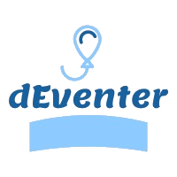
</h1>

**Realizado por:**

* Martín Escamilla, José Ignacio
* Ahamad, Achraf
* Estornell Salamanca, Alejandro Antonio

## Índice

1. [Introducción](#introducción)
2. [Objetivos del proyecto](#objetivos-del-proyecto)
3. [Requisitos](#requisitos)
   1. [Casos de uso](#casos-de-uso)
4. [Tecnologías utilizadas](#tecnologías-utilizadas)
   1. [Firebase](#firebase)
      1. [Firebase Authentication](#firebase-authentication)
      2. [Firebase Realtime Database](#firebase-realtime-database)
      3. [Cloud Storage](#cloud-storage)
      4. [Firebase Cloud Messaging](#firebase-cloud-messaging)
      5. [Cloud Functions](#cloud-functions)
   2. [Java](#java)
   3. [Android](#android)
   4. [Material Design](#material-design)
   6. [Google Maps Platform](#google-maps-platform)
   5. [Otros](#otros)
      1. [Android Studio](#android-studio)
      2. [Git y GitHub](#git-y-github)
      3. [Diagrams](#diagrams)
5. [Modelo de datos](#modelo-de-datos)
6. [Arquitectura de _software_](#arquitectura-de-software)
7. [Patrones de diseño](#patrones-de-diseño)
   1. [Patrón MVC](#patrón-mvc)
   2. [Patrón MVP](#patrón-mvp)
   3. [Patrón MVVM](#patrón-mvvm)
   4. [Elección del patrón](#elección-del-patrón)
8. [Configuración de Firebase](#configuración-de-firebase)
   1. [Configuración general del proyecto](#configuración-general-del-proyecto)
      1. [Crear el proyecto en Firebase](#crear-el-proyecto-en-firebase)
      2. [Registrar la aplicación en Firebase](#registrar-la-aplicación-en-firebase)
      3. [Añadir el archivo de configuración de Firebase](#añadir-el-archivo-de-configuración-de-firebase)
      4. [Añadir el SDK de Firebase a la _app_](#añadir-el-sdk-de-firebase-a-la-app)
   2. [Configuración de Firebase Authentication](#configuración-de-firebase-authentication)
   3. [Configuración de Cloud Firestore](#configuración-de-cloud-firestore)
   4. [Configuración de Cloud Storage](#configuración-de-cloud-storage)

9. [Aplicación móvil](#aplicación-móvil)
    1. [Introducción](#introducción)
    2. [Breve estudio visual](#breve-estudio-visual)
    3. [_View_](#view)
    4. [_ViewModel_](#viewmodel)
    5. [_Model_](#model)
10. [Conclusión](#conclusión)
11. [Mejoras](#mejoras)
12. [Bibliografía](#bibliografía)

## Introducción

Es 2020, han pasado más de 10 años desde la presentación del sistema operativo Android —en 2007, el día 5 de noviembre— y el lanzamiento del primer _smartphone_ en hacer uso de este —HTC Dream, anunciado el 23 de septiembre de 2008 y puesto a la venta un mes más tarde, el 20 de octubre de 2008—. Desde entonces, sin apenas competencia con la excepción de Apple y su incursión en el terreno móvil gracias al iPhone y su sistema operativo iOS, Android es el dominador absoluto del mercado. Para ello una muestra:

* En mayo de 2019 superó la barrera de 2.500 millones de dispositivos activos mensuales.

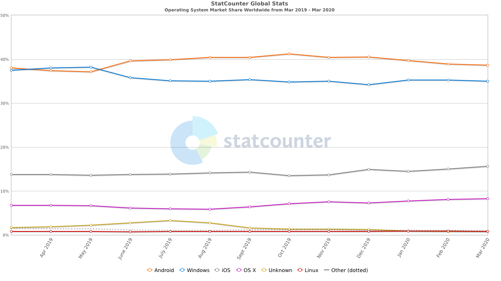

* En los últimos doce meses, contaba con una cuota de mercado del 38.61 % entre todos los sistemas operativos —Windows, iOS, OS X y Linux—; ocupando la primera posición.

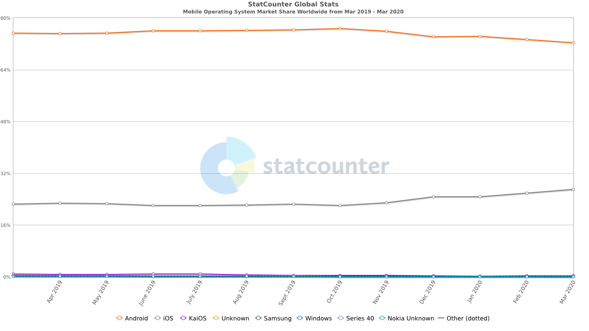

* Si atendemos exclusivamente al mercado móvil, este liderazgo aumenta considerablemente sobre el resto hasta alcanzar un 72.26 % en marzo de 2020 por el 27.03 % de iOS —el resto de opciones son marginales, inferiores a 0.1 %—.

En otro orden, dado que, como ha de suponerse, nos centraremos en el sistema operativo Android, conviene tener en cuenta la distribución de versiones de la plataforma en el mercado. O lo que es lo mismo, el porcentaje de uso de cada una de las API lanzadas cada cierto tiempo —anualmente— para, con esta información decidir a cuál de estas —o, más concretamente, desde cuál—, damos soporte.

El panel de distribución oficial suministrado por el canal de Android Developers data del 7 de mayo de 2019 y, aunque útil, no coincide con la situación real en marzo de 2020 —momento en el que comenzamos con el proyecto—. Con todo, los datos, como primera toma de contacto, pueden servir de impresión inicial. Es ahí donde se observa lo siguiente:

<p align="center">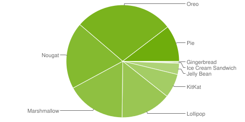</p>

| Version | Codename | API | Distribution |
| ------- | -------- | --- | ------------ |
| 2.3.3 - 2.3.7 | Gingerbread | 10 | 0.3 % |
| 4.0.3 - 4.0.4	| Ice Cream Sandwich | 15 | 0.3 % |
| 4.1.x	| Jelly Bean | 16 | 1.2 % |
| 4.2.x	|   | 17 | 1.5 % |
| 4.3 |   | 18 | 0.5 % |
| 4.4 | KitKat | 19 | 6.9 % |
| 5.0 | Lollipop | 21 | 3.0 % |
| 5.1 |   | 22 | 11.5 % |
| 6.0 | Marshmallow | 23 | 16.9 % |
| 7.0 | Nougat |24 | 11.4 % |
| 7.1 |   | 25 | 7.8 % |
| 8.0 | Oreo | 26 | 12.9 % |
| 8.1 |   | 27 | 15.4 % |
| 9 | Pie | 28 | 10.4 % |

El problema de la tabla superior es su falta de actualización. Es por ello que para conocer mejor el _estado real de las cosas_ debemos recurrir a otras herramientas de visualización de datos en _tiempo real_ —mensualidad entendida como tiempo real—. Ya la hemos utilizado previamente, en la comparación de cuotas de mercado. Se trata de StatCounter, una plataforma de análisis de tráfico _web_ —entre otros— que nos proporciona justo la información que necesitamos actualmente sobre la distribución de Android a nivel mundial. La siguiente imagen, sacada de esta herramienta, vislumbra un panorama bastante distinto:

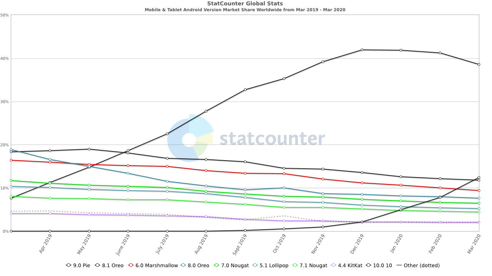

* Por un lado, aparece en escena una nueva versión estable de la API de Android: Android 10 o API 29. Hay que tener en cuenta asimismo, según informa la página de desarrollo oficial de Android, que está en camino Android 11 —API 30—; en principio para este mismo año, 2020 y ya han distribuido las Developer Preview o, lo que es lo mismo, versiones que podríamos entender por _alpha_ o _beta_ para los desarrolladores.
* Por el otro lado, aun en estancamiento y descenso desde diciembre de 2019, Android 9 Pie copa el 38.57 % del mercado, Android 10 consigue situarse en segunda posición gracias a su 12.45 % y, a partir de ahí, la tercera posición queda para Android 8.1 Oreo —11.82 %—. En total, la suma de cuotas de Android 8.0 Oreo en adelante constituye el 70.46 % de los dispositivos con Android instalados y actualmente en uso.

Será vital, en su momento —y más si nos lo planteamos como una situación de trabajo real—, ponderar las cifras anteriores. Especialmente en lo relativo al SDK mínimo con el que trabajemos —versión más baja de Android a la que damos soporte o en la que puede ser instalada y utilizada nuestra aplicación— y el SDK _target_ u objetivo; aquella para la que desarrollamos y compilamos haciendo uso de sus librerías y con la que es totalmente compatible.

No escapa a nadie que el uso de aplicaciones móviles está —y lleva— en auge desde hace bastante tiempo, en tendencia ascendente. Para todo tipo de sectores y acciones que nunca habríamos imaginado. Pero la innovación siempre encuentra su camino y si no, lo hace.

Ya lo señaló el informe _Sociedad Digital en España 2018_ publicado el año pasado por la Fundación Telefónica: el _smartphone_ es el dispositivo preferido por el 91.9 % de la población española para cualquier tipo de uso.

De dicho informe pueden extrarse más datos relevantes que vienen a consolidar la afirmación que hicimos antes: la descarga y uso de aplicaciones móviles no para de crecer. Entre estos encontramos:

* En 2017 se descargaron 178.100 millones de _apps_. Cifra que aumentó hasta los 258.200 millones de 2019 y que se traduce en una subida del 44 %.
* Los usuarios valoran en una aplicación —en orden descendiente—:
  1. Cubrir una necesidad: 72 %.
  2. Ausencia de publicidad intrusiva: 57 %.
  3. Consumo bajo de datos: 46 %.
* El 32 % de la población dedica más de 20 horas semanales a _apps_, el 13 % entre 16 y 20 horas, el 17 % se mantiene en una franja que va desde las 11 horas hasta las 16, el 25 % entre 6 y 10 horas y, por último, el 13 % restante llega a las 5 horas.
* El dispositivo preferido para la mensajería instantanéa es el _smartphone_ por un 86.7 %. Esta predominancia se observa también en el acceso a redes sociales; sigue siendo el dispositivo predilecto con una cifra cercana al 60 %.

Esta breve presentación de datos no hacen sino confirmar la premisa de la que partíamos: el uso de las aplicaciones continúa su senda de crecimiento; y no parece que vaya a verse mermada en el corto plazo.

La introducción tenía el propósito de servir de preámbulo a nuestro proyecto y ofrecer unas pinceladas iniciales que dieran, más o menos, cuenta, a partir de la información presentada, de la senda que pretendemos tomar para el módulo profesional de Proyecto. De alguna forma hemos de defenderlo, y creemos que se asienta sobre una base de mercado bastante estable, robusta y con posibilidades de éxito.

Nuestro objetivo es el desarrollo de una aplicación móvil para el sistema operativo Android en la que los usuarios tengan la oportunidad de crear eventos —lo que comúnmente se conoce como _quedadas_, planes o actividades; aquí funcionan como sinónimos— de cualquier tipo y, a través de esta, otros usuarios —amigos, conocidos o incluso desconocidos— vean estas actividades y se unan a ellas si están interesados.

De este modo, los usuarios registrados que utilicen la _app_ serán capaces tanto de ver las actividades que otros han creado y a las que pueden apuntarse, como de subir las propias para que otros se inscriban.

Todo ello aderezado de un conjunto de características adicionales —como _chat_ entre los miembros inscritos a una actividad— que detallaremos en profundidad durante el desarrollo de este documento; en futuros apartados.

El deseo y la decisión de llevar a cabo una aplicación de este tipo se tomó a principios de marzo —con lo lejos, aparentemente, que queda ya en el momento de escribir esto—. La decisión se basaba, entre otros, en tres pilares fundamentales.

Uno, no encontrábamos una aplicación en `Play Store` que supliera esta necesidad —propia para el caso— de forma específica y según nuestros requisitos. Sí, es cierto que existen gigantes como Meetup o Eventbrite. El problema de estas es, por un lado, la orientación de la primera al hecho de conocer gente nueva y no tanto a la organización de planes con conocidos y, por el otro, el carácter profesional o corporativo asociado a Eventbrite —más en la línea del _coworking_, emprendimiento y desarrollo de _startups_—.

Dos, Fever, una propuesta potente, asentada, y bastante similar en apariencia a la nuestra, se posiciona del lado del promotor de la actividad, de empresas cuya actividad consiste, precisamente, en eso, en crear y organizar planes, normalmente con un coste asociado. A fin de cuentas, no deja de ser una plataforma en la que grandes cadenas de restauración, teatros, conciertos, museos... publican las actividades que organizan —aun sin depender de Fever y disponibles por otros medios— para que, gracias precisamente a Fever, el usuario final o cliente de estos se decida por una y compre el tique. No deja de ser similar a Ticketmaster y alternativas parecidas.

Nuestra idea, por el contrario, no podía estar más alejada. Queremos desarrollar una aplicación en las antípodas de las anteriores, con un toque desenfadado, alejada de toda pretensión de explotación comercial por parte de posibles colaboradores futuros que quieran publicar en ella sus productos —eventos o actividades— a aquellos que la usen.

Debe entenderse como un lugar en el que concretar aquel partido de fútbol que siempre se intenta jugar entre amigos y nunca sale; ese _ya si eso quedamos_ tan común con compañeros o conocidos a los que nos encontramos tras demasiado tiempo sin saber de ellos; o, por qué no, para organizar la salida del viernes por la noche con los compañeros de clase. El contenido ha de estar generado, en todo momento, por usuarios particulares e individuales. Las empresas que pudieran estar asociadas a los lugares en los que van a tener lugar esos eventos no son el tipo de usuario que esperamos en nuestra aplicación.

Y tres; tras una búsqueda de mayor profundidad, dimos con alternativas más alineadas con los objetivos que planteamos: dplanes, Plan & Go y GeoKeda. Las dos primeras desaparecieron de las _stores_ en las que estaban disponibles; desconemos los motivos que llevaron a dicho cierre en dplanes, pero Plan & Go dejó de estar disponible el 30 de septiembre de 2019 por falta de apoyo financiero aun habiendo conseguido más de 50.000 descargas en su primer año en Google Play. Plan & Go es, de hecho, la aplicación que más se asemeja a dEventer. Está en primera instancia orientada a los ciudadanos de la comunidad de Madrid y, lo más importante, se centraba en planes sin ánimo de lucro por el organizador, a pesar de que los hubiera con pagos para acceder a los lugares en los que tendría lugar el evento. GeoKeda, por su parte, sigue en activo con, también, más de 50.000 descargas en Play Store y los usuarios continúan usándola a día de hoy. No obstante, creemos que su aspecto está demasiado anclado en el Material Design presentado allá por 2014 y la última actualización que recibió la _app_ móvil fue el 18 de abril de 2017, hace más de tres años, lo cual deja entrever la falta de soporte actual y el añadido de nuevas características y funcionalidades.

Como ya se señaló previamente, esta decisión se tomó en los primeros días de marzo, cuando la coyuntura todavía era propicia y no nos había alcanzado la crisis asociada al COVID-19. Tras el estado de alarma decretado por el Gobierno de España, las restricciónes a la libre circulación y reunión de personas y la lenta recuperación y vuelta a la normalidad que se prevé, especialmente en materia sociocultural, pudiera parecer el momento menos adecuado para un desarrollo de esta naturaleza. No podemos negar la mayor, lo sabemos, no es la situación adecuada para que prospere. No obstante, confiamos en que tras la recuperación, con el paso del tiempo, fuera capaz de erigirse en una opción válida para la realización de actividades con un fuerte componente social y, sobre todo, sin grandes pretensiones; planes sencillos que surgen en el día a día y no cuestan nada o casi nada.

## Objetivos del proyecto

El objetivo y reto principal, creemos, al que nos vamos a enfrentar es el diseño y desarrollo de una base de datos NoSQL en la nube que, además, no necesite de una capa intermedia o _web service_ entre la aplicación y esta. Su dificultad no reside tanto en el funcionamiento intrínseco de esta modalidad de almacenamiento de datos, sino en la curva de aprendizaje asociada, pues hemos trabajado poco con este tipo de tecnologías.

Los usuarios crearán una cuenta —con correo electrónico y contraseña—, iniciarán sesión con esta, o con un proveedor externo como Google, y, a partir de ahí podrán, como hemos señalado con anterioridad, visualizar el listado de planes disponibles para ellos —si la actividad no tiene límite de participantes o no lo ha alcanzado si lo tiene— e inscribirse en uno.

Junto al listado previo, dispondrá de otro compuesto por los planes a los que ya se ha apuntado o en los que ya ha participado.

Finalmente, y esto constituye el otro gran reto de recurrir a una base de datos NoSQL _cloud_, para cada actividad hay asociado un _chat_ en el que los usuarios inscritos pueden ir hablando antes, durante y tras la realización del plan propuesto. ¿Qué implicaciones tiene este _chat_? La base de datos y la aplicación deben sincronizarse en tiempo real. Más adelante explicaremos cómo hemos sorteado esta dificultad gracias, en gran parte, a las tecnologías sobre las que se asienta la aplicación, sin las cuales esta _feature_ se habría vuelto demasiado compleja de desarollar.

## Requisitos

En primera instancia, definimos una serie de funcionalidades o características que nos gustaría ver desarrolladas en la aplicación. Tomando esa lista como base, seleccionamos las más viables teniendo siempre presente las limitaciones de tiempo para entregar el proyecto. Las características que quedaron fuera se proponen como mejoras en el apartado correspondiente —junto las que valoramos _a posteriori_.

Dadas las aclaraciones pertinentes, el usuario debe poder en relación a:

* Su perfil:
  * Crear el perfil.
  * Añadir una foto.
  * Modificar la foto.
* Las actividades:
  * Crear una actividad.
  * Ver las actividades disponibles.
  * Ver las actividades a las que se ha inscrito.
  * Apuntarse a una actividad.
  * Darse de baja de una actividad.
* Los _chats_:
  * Ver los _chats_ disponibles.
  * Enviar mensajes en los _chats_.
  * Recibir mensajes de los _chats_.
  * Recibir notificaciones _push_ por la entrada de nuevos mensajes.
  * Enviar imágenes.

A lo anterior, nosotros como desarrolladores, establecimos un par de puntos o pautas que nos marcamos. Trateremos de seguirlas lo máximo posible:

1. La capa de presentación —la aplicación propiamente dicha— debe seguir alguno de los patrones de arquitectura de _software_. A saber:
   1. Modelo-vista-controlador.
   2. Modelo-vista-presentador.
   3. Modelo-vista-modelo de vista.
2. El apartado visual tiene por objeto la búsqueda de un diseño limpio y agradable a la vista —a pesar de lo subjetivo que puede llegar a ser este punto—. Para ello contamos con las pautas marcadsa por la guía de diseño —más bien _framework_— oficial de Google para Android: Material Design.

Tan solo un apunte; adelantamos ya que el patrón de _software_ escogido es MVVM o _model_-_view_-_viewmodel_. Obviamente, se estudiaron los tres y en base a ventajas, desventajas y facilidades fue este el que nos pareció más adecuado.

### Casos de uso

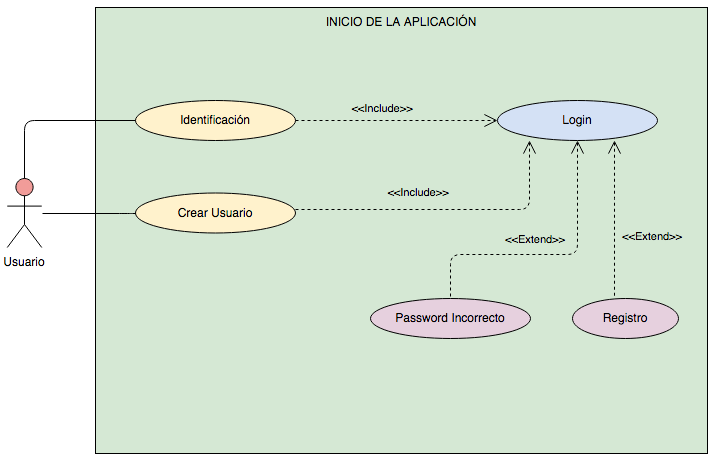

## Tecnologías utilizadas

### Firebase

Antes de entrar en detalle a explicar los servicios o productos específicos a los que hemos recurrido dentro de Firebase, es menester dar una somera pincelada de lo que ofrece y por qué se ajusta perfectamente a las necesidades del proyecto.

En resumidas cuentas, Firebase es una plataforma de _backend_ para el desarrollo de aplicaciones móviles y _web_, entre otras. Podría afirmarse, en última instancia, que es multiplataforma pues proporciona las herramientas y SDK para:

* Android: Java.
* iOS: Swift y Objective-C.
* _Web_: Node.js con JavaScript o TypeScript.
* Motor de videojuegos Unity: JavaScript o C#.
* Desarrollo de Java nativo.
* Desarrollo en C++.

Su fortaleza radica, principalmente, en las facilidades que nos brinda como desarrolladores a través de los diversos SDK para el acceso a sus servicios sin vernos obligados al lanzamiento, mantenimiento y escala —según demanda— de diversas instancias que nos provean de servidores para inicios de sesión, bases de datos, almacenamiento de imágenes, recopilación de estadísticas... Se trata de un conjunto de tecnologías en la nube _serverless_ o sin servidor. No porque no se ejecute sobre una máquina que actúa de servidor, sino porque la nube lo provee y automática y, lo que es más importante, dinámicamente  administra los recursos de esta máquina, ofuscando, normalmente, al desarrollador las operaciones relacionadas con la capacidad, el mantenimiento y la escala de estas.

Esta naturaleza _serverless_ de Firebase nos permite, por ejemplo, subir código a producción simplificando todo el proceso y el precio a pagar depende únicamente del número de recursos consumidos por la aplicación en tiempo real, durante el tiempo que son usados o activados y no es necesario contar con un servidor activo 24/7. No obstante, cada producto del _framework_ tiene sus peculiaridades en las que entraremos más adelante.

Además, dada su compra por parte de Google en 2014, se encuentra integrado por completo en la nube del gigante: Google Cloud. Por tanto, contamos con los servicios de Firebase y, gracias a esta integración, bajo el mismo plan es posible acceder a API como Maps y Places que utilizaremos en la _app_ para ofrecer funcionalidades de geolocalización a los usuarios.

Por último, previo paso a profundizar, conviene un apunte relativo al plan gratuito, denominado Spark Plan. Los límites del plan son lo suficientemente elevados como para poder utilizarlo con total normalidad, al menos mientras realizamos las pruebas en el desarrollo de la aplicación y para las demostraciones de uso. Véase:

* Las siguientes herramientas son totalmente gratis y no tienen límites asociados para su utilización:
  * A/B Testing
  * Analytics
  * App Distribution
  * App Indexing
  * Firebase Cloud Messaging
  * Crashlytics
  * Dynamic Links
  * In-App Messaging
  * Performance Monitoring
  * Predictions
  * Remote Config
* Para el resto, los límites varían:
  * Firebase Authentication: todas las verificaciones son gratuitas excepto las que se realizan a través del teléfono —llamada o SMS—, que tienen un límitie de 10.000 mensuales.
  * Cloud Firestore:
    * Almacenamiento total: 1 GB
    * Descargas: 10 GB al mes
    * Escrituras: 20.000 al día
    * Lecturas: 50.000 al día
    * Eliminaciones: 20.000 al día
  * Cloud Functions:
    * Llamadas a funciones: 125.000 al mes
    * GB/segundos: 40.000 al mes
    * CPU/segundos: 40.000 al mes
  * Hosting:
    * Almacenamiento total: 10 GB
    * Trasferencias: 10 GB al mes
    * Permite múltiples sitios _web_ por proyecto y el uso de dominios personalizados y certificados SSL sin coste.
    * ML Kit:
      * Las API cliente son gratuitas, así como un modelo personalizado de Hosting/Serving
      * El conjunto de imágenes utilizado para entrenar la IA debe ser, máximo, de 1.000 por proyecto
      * Cada proyecto cuenta con 3 horas de entrenamiento de la IA
    * Firebase Realtime Database:
      * Conexiones simultáneas: 100
      * Almacenamiento total: 1 GB
      * Descargas: 10 GB al mes
     * Cloud Storage:
       * Almacenamiento total: 5 GB
       * Descargas: 1GB al día
       * Operaciones de subida: 20.000 al día
       * Operaciones de descarga: 50.000 al día
      * Test Lab
        * Pruebas en dispositivos virtuales: 10 al día
        * Pruebas en dispositivos físicos: 5 al día

#### Firebase Authentication

#### Firebase Realtime Database

#### Cloud Storage

#### Firebase Cloud Messaging

#### Cloud Functions

### Java

### Android

### Material Design

### Google Maps Platform

### Otros

#### Android Studio

#### Git y GitHub

#### Diagrams

## Modelo de datos

## Arquitectura de _software_

## Patrones de diseño

### Patrón MVC

### Patrón MVP

### Patrón MVVM

### Elección del patrón

## Configuración de Firebase

### Configuración general del proyecto

Requisitos:

* Android Studio
* La API objetivo es Jelly Bean —número de versión 16— o superior.
* Gradle 4.1 o superior.
* Jetpack —AndroidX— cumpliendo:
  * `com.android.tools.build:gradle` v3.2.1 o más reciente.
  * `compileSdkVersion` 28 o posterior.
* Configurar un dispositivo físico o un emulador en el que ejecutar la aplicación.
* Iniciar sesión en Firebase.

Usamos el flujo de trabajo recomendado con la consola de Firebase; la otra opción recurre al asistente de Firebase para Android Studio y necesita pasos adicionales para su puesta en marcha.

#### Crear el proyecto en Firebase

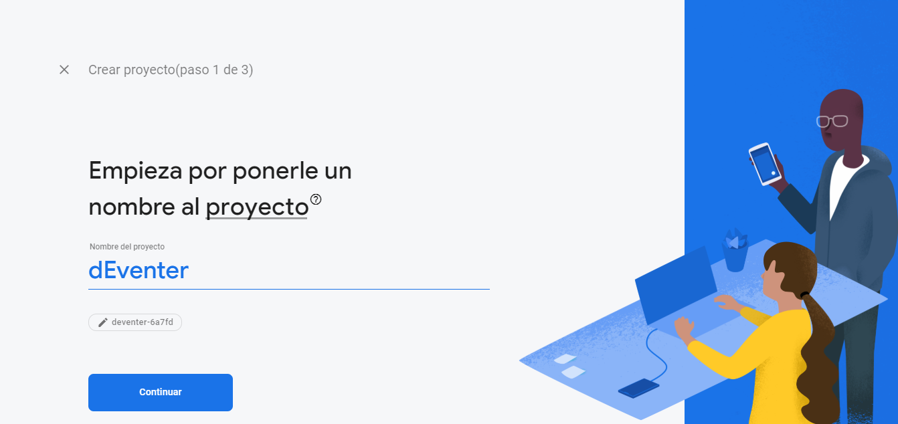

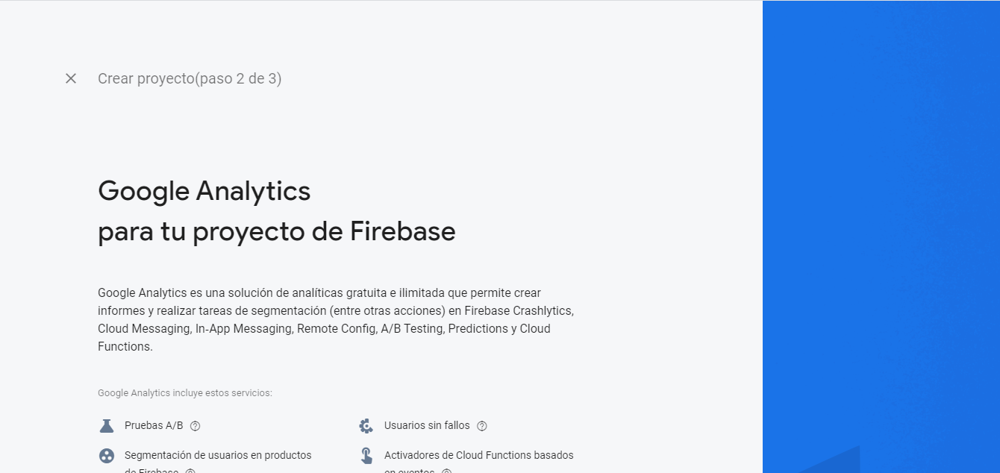

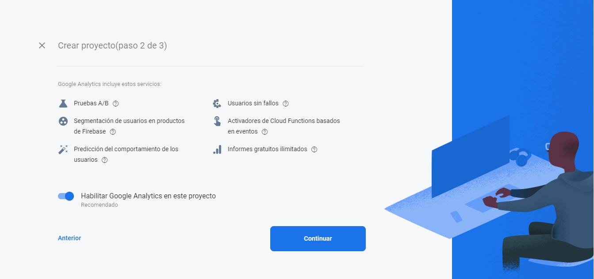

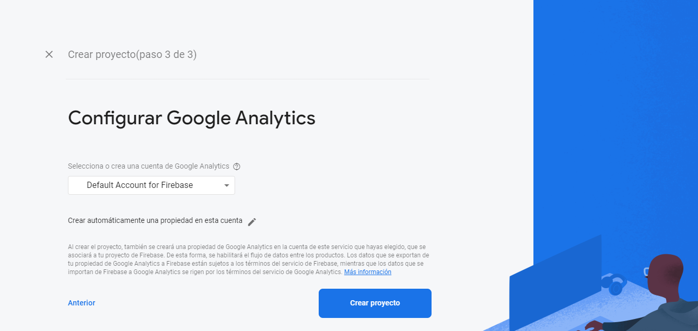

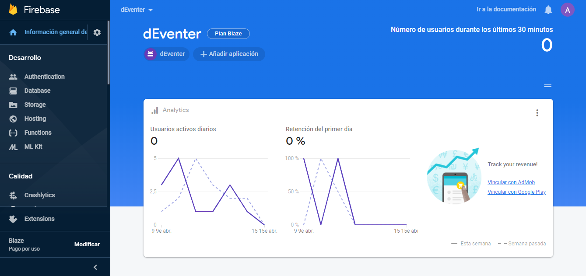

#### Registrar la aplicación en Firebase

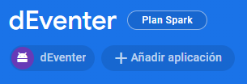

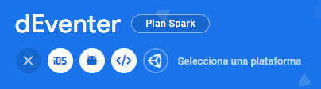

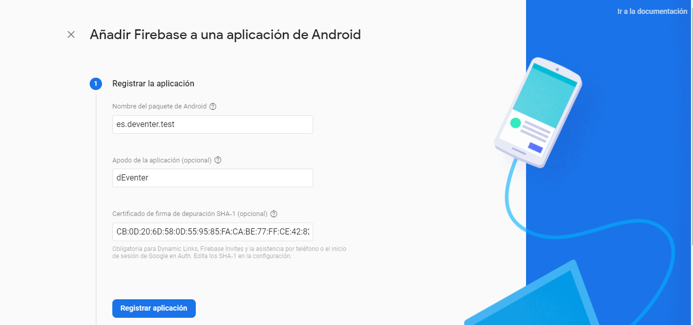

`app/build.gradle`
```gradle
// ...
android {
	// ...
    defaultConfig {
        applicationId "es.deventer.test"
        // ...
    }
	// ...
}
```

`SHA-1`
```
$ keytool -list -v -alias androiddebugkey -keystore %USERPROFILE%\.android\debug.keystore
```

`SHA-1`
```
Nombre de Alias: androiddebugkey
Fecha de Creación: 23-mar-2020
Tipo de Entrada: PrivateKeyEntry
Longitud de la Cadena de Certificado: 1
Certificado[1]:
Propietario: C=US, O=Android, CN=Android Debug
Emisor: C=US, O=Android, CN=Android Debug
Número de serie: 1
Válido desde: Mon Mar 23 20:46:00 CET 2020 hasta: Wed Mar 16 20:46:00 CET 2050
Huellas digitales del certificado:
         MD5: DB:E6:70:E9:AF:7D:6E:A4:0C:6E:A9:B4:92:58:35:8C
         SHA1: CB:0D:20:6D:58:0D:55:95:85:FA:CA:BE:77:FF:CE:42:82:DC:F3:63
         SHA256: C8:C2:65:F9:79:F5:63:B8:7B:41:1A:AF:5C:27:36:11:1A:21:1C:6C:CB:95:EA:85:29:21:59:74:85:EB:B5:6D
Nombre del algoritmo de firma: SHA1withRSA
Algoritmo de clave pública de asunto: Clave RSA de 2048 bits
Versión: 1
```

#### Añadir el archivo de configuración de Firebase

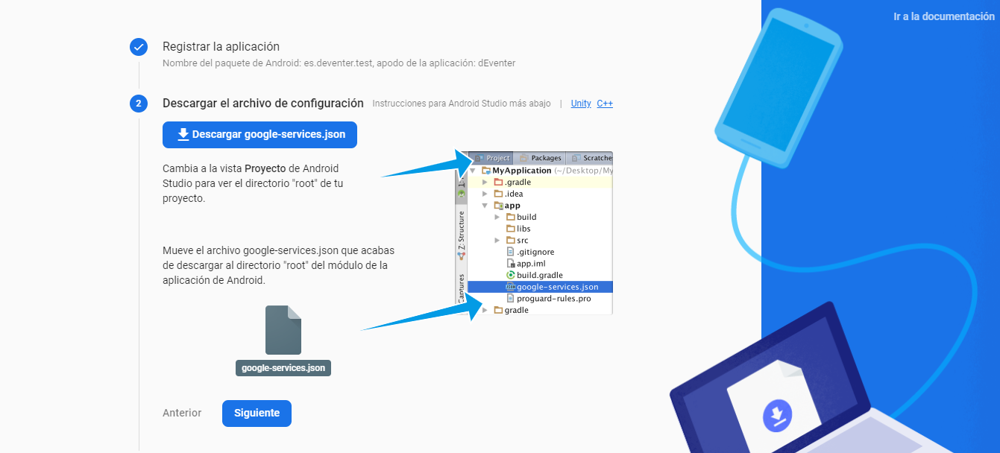

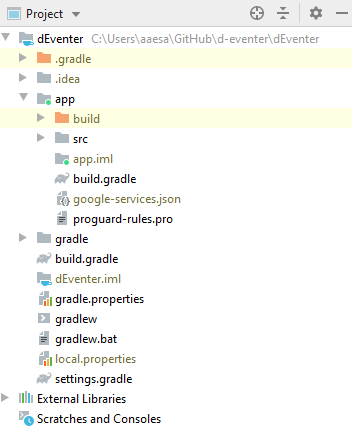

`project/build.gradle`
```gradle
buildscript {
  repositories {
    // Check that you have the following line (if not, add it):
    google()  // Google's Maven repository
  }
  dependencies {
    // ...
    // Add this line
    classpath 'com.google.gms:google-services:4.3.3'
  }
}

allprojects {
  // ...
  repositories {
    // Check that you have the following line (if not, add it):
    google()  // Google's Maven repository
    // ...
  }
}
```

`app/build.gradle`
```gradle
apply plugin: 'com.android.application'
// Add the following line:
apply plugin: 'com.google.gms.google-services'  // Google Services plugin

android {
  // ...
}
```

#### Añadir el SDK de Firebase a la _app_

`app/build.gradle`
```gradle
dependencies {
  // ...

  // Add the Firebase SDK for Google Analytics
  implementation 'com.google.firebase:firebase-analytics:17.3.0'

  // Add the dependencies for any other Firebase products you want to use in your app
  // For example, to also use Firebase Authentication
  implementation 'com.google.firebase:firebase-auth:19.3.0'

  // Getting a "Could not find" error? Make sure that you've added
  // Google's Maven repository to your root-level build.gradle file
}
```

`app/build.gradle`
```gradle
dependencies {
  // Import the platform
  implementation platform('com.google.firebase:firebase-bom:25.2.2')

  // When using a BoM, dependencies don't require a specified version
  // If you do specify a version, it overrides the library version specified in the BoM
  implementation 'com.google.firebase:firebase-auth'
  implementation 'com.google.firebase:firebase-firestore'
}
```

### Configuración de Firebase Authentication

### Configuración de Cloud Firestore

### Configuración de Cloud Storage

## Aplicación móvil

### Introducción

### Breve estudio visual

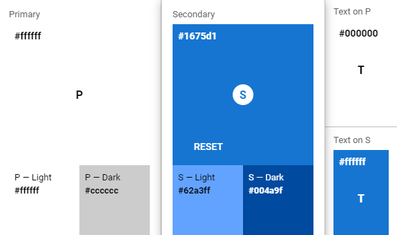

### _View_

### _ViewModel_

### Model

### Conclusión

### Mejoras

En relación a los perfiles:

* Borrar el perfil.
* Cambiar el correo electrónico.
* Cambiar la contraseña.
* Eliminar la foto.

En relación a los planes:

* Buscador simple y avanzado: con filtros como categorías, localización, proximidad, etc.
* Recomendador automático y personalizado de planes en base a gustos, preferencias, geolocalización...
* Valoración del resto de usuarios.
* Borrar una actividad.

En relación a la seguridad de los datos tratados:

* Cifrado de contraseñas, información personal y _chats_.

En relación al _backend_:

* Unificar _backends_ de las aplicaciones móvil y _web_.
* Mejorar la implementación MVVM.

## Bibliografía

* [Wikipedia | Android (operating system) History](https://en.wikipedia.org/wiki/Android_(operating_system)#History)
* [Open Handset Alliance | Industry Leaders Announce Open Platform for Mobile Devices](http://www.openhandsetalliance.com/press_110507.html)
* [TechCrunch | Breaking: Google Announces Android and Open Handset Alliance](https://techcrunch.com/2007/11/05/breaking-google-announces-android-and-open-handset-alliance)
* [Google Official Blog | Where's my Gphone?](https://googleblog.blogspot.com/2007/11/wheres-my-gphone.html)
* [Gizmodo | T-Mobile G1: Full Details of the HTC Dream Android Phone](https://gizmodo.com/t-mobile-g1-full-details-of-the-htc-dream-android-phon-5053264)
* [Wikipedia | HTC Dream Release](https://en.wikipedia.org/wiki/HTC_Dream#Release)
* [Wikipedia | Android (operating system) Market share](https://en.wikipedia.org/wiki/Android_(operating_system)#Market_share)
* [Official Android Twitter | 2.5 Billion Monthly Active Devices](https://twitter.com/Android/status/1125822326183014401)
* [Wikipedia | Usage share of operating systems](https://en.wikipedia.org/wiki/Usage_share_of_operating_systems)
* [StatCounter Global Stats | Operating System Market Share Worldwide](https://gs.statcounter.com/os-market-share)
* [StatCounter Global Stats | Mobile Operating System Market Share Worldwide](https://gs.statcounter.com/os-market-share/mobile/worldwide)
* [Android Developers | Distribution dashboard](https://developer.android.com/about/dashboards)
* [StatCounter Global Stats | Mobile & Tablet Android Version Market Share Worldwide](https://gs.statcounter.com/os-version-market-share/android/mobile-tablet/worldwide)
* [StatCounter](https://statcounter.com)
* [Wikipedia | StatCounter](https://en.wikipedia.org/wiki/StatCounter)
* [Wikipedia | Android (operating system) Platform information](https://en.wikipedia.org/wiki/Android_(operating_system)#Platform_information)
* [Wikipedia | Android version history](https://en.wikipedia.org/wiki/Android_version_history)
* [Official Android 8.0 Oreo](https://www.android.com/versions/oreo-8-0)
* [Android Developers | Android Oreo Overview](https://developer.android.com/about/versions/oreo)
* [Official Android 9.0 Pie](https://www.android.com/versions/pie-9-0)
* [Android Developers | Android 9 Pie Overview](https://developer.android.com/about/versions/pie)
* [Official Android 10.0](https://www.android.com/android-10)
* [Android Developers | Android 10 Home](https://developer.android.com/about/versions/10)
* [Android Developers | Android 11 Developer Preview Home](https://developer.android.com/preview)
* [Android Developers | Android 11 Developer Preview Release Notes](https://developer.android.com/preview/release-notes)
* [Fundación Telefónica | Sociedad Digital en España 2018](https://www.fundaciontelefonica.com/cultura-digital/publicaciones/sociedad-digital-en-espana-2018/655)
* [Wikipedia | Meetup](https://en.wikipedia.org/wiki/Meetup)
* [Meetup](https://www.meetup.com)
* [Wikipedia | Eventbrite](https://en.wikipedia.org/wiki/Eventbrite)
* [Eventbrite](https://www.eventbrite.com)
* [Fever](https://feverup.com)
* [dplanes](http://dplanes.es)
* [Plan & Go](https://www.planandgoapp.com)
* [Hablemos de Empresas | Plan & Go, la App que cambiará tu forma de disfrutar del tiempo libre](https://hablemosdeempresas.com/autonomos/plan-and-go-app)
* [El Referente | Plan & Go, la app que permite compartir planes en Madrid, ya disponible en iOS](https://www.elreferente.es/tecnologicos/plan-go-disponible-ios-31978)
* [El Referente | Plan & Go cierra una ronda de financiación de 150.000 euros](https://www.elreferente.es/mas---/ronda-de-financiacion-plan-and-go-32757)
* [El País | Sube tu propuesta y conoce gente](https://elpais.com/ccaa/2017/12/30/madrid/1514650159_393417.html)
* [Applicantes | Plan&go cerrará el próximo 30 de septiembre](https://applicantes.com/plan-and-go-cierra-30-septiembre/)
* [GeoKeda](https://madrid.geokeda.es)
* [Wikipedia | Ticketmaster](https://en.wikipedia.org/wiki/Ticketmaster)
* [Ticketmaster](https://www.ticketmaster.com)
* [Tutorialspoint | Learn MVC Framework](https://www.tutorialspoint.com/mvc_framework/index.htm)
* [Tutorialspoint | Learn MVVM](https://www.tutorialspoint.com/mvvm/index.htm)
* [Tutorialspoint | Design Patterns - MVC Pattern](https://www.tutorialspoint.com/design_pattern/mvc_pattern.htm)
* [Medium | Android Architecture Patterns Part 1: Model-View-Controller](https://medium.com/upday-devs/android-architecture-patterns-part-1-model-view-controller-3baecef5f2b6)
* [Medium | Android Architecture Patterns Part 2: Model-View-Presenter](https://medium.com/upday-devs/android-architecture-patterns-part-2-model-view-presenter-8a6faaae14a5)
* [Medium | Android Architecture Patterns Part 3: Model-View-ViewModel](https://medium.com/upday-devs/android-architecture-patterns-part-3-model-view-viewmodel-e7eeee76b73b)
* [Medium | Model View Presenter(MVP) in Android with a simple demo project](https://medium.com/cr8resume/make-you-hand-dirty-with-mvp-model-view-presenter-eab5b5c16e42)
* [raywenderlich.com | Getting Started with MVP (Model View Presenter) on Android](https://www.raywenderlich.com/7026-getting-started-with-mvp-model-view-presenter-on-android)
* [Material Design](https://material.io)
* [Wikipedia | Material Design](https://en.wikipedia.org/wiki/Material_Design)
* [Firebase](https://firebase.google.com)
* [Wikipedia | Firebase](https://en.wikipedia.org/wiki/Firebase)
* [TechCrunch | Google Acquires Firebase To Help Developers Build Better Real-Time Apps](https://techcrunch.com/2014/10/21/google-acquires-firebase-to-help-developers-build-better-realtime-apps)
* [Wikipedia | Serverless computing](https://en.wikipedia.org/wiki/Serverless_computing)
* [Google Cloud Platform](https://cloud.google.com)
* [Wikipedia | Google Cloud Platform](https://en.wikipedia.org/wiki/Google_Cloud_Platform)
* [Firebase Pricin Plans](https://firebase.google.com/pricing)
* [Firebase Docs | Add Firebase to your Android project](https://firebase.google.com/docs/android/setup)
* [Material Design The color system](https://material.io/design/color/the-color-system.html)
* [Material Design Color Tool](https://material.io/resources/color)
* [Material Design Applying color to UI](https://material.io/design/color/applying-color-to-ui.html)
* [Material Design Color usage](https://material.io/design/color/color-usage.html)
* [Material Design Text legibility](https://material.io/design/color/text-legibility.html)
* [Free Logo Maker](https://logomakr.com/)

---

> Portions of this page are reproduced from work created and shared by the Android Open Source Project and used according to terms described in the Creative Commons 2.5 Attribution License.

---

> Portions of this page are modifications based on work created and shared by the Android Open Source Project and used according to terms described in the Creative Commons 2.5 Attribution License.
