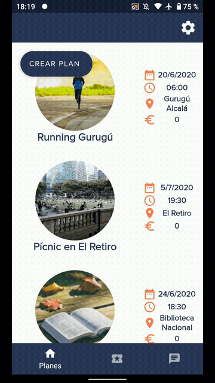
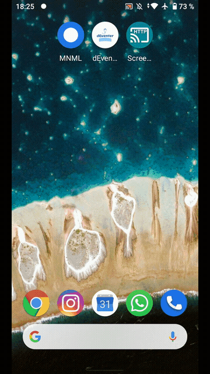
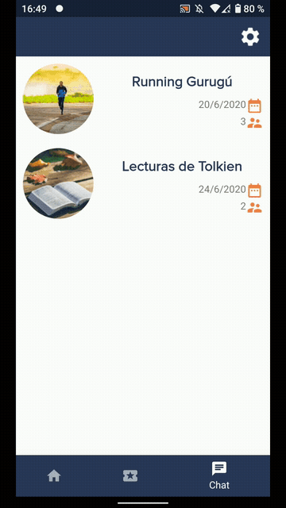

### User Guide

	<table>
		<tr>
			<td>
<b>Registrarse</b>
</td>
			<td>
<b>Iniciar sesión</b>
</td>
			<td>
<b>Cerrar sesión</b>
</td>
		</tr>
		<tr>
			<td></td>
			<td></td>
			<td></td>
		</tr>
		<tr>
			<td>
<b>Iniciar sesión con huella</b>
</td>
			<td>
<b>Mantener la sesión iniciada</b>
</td>
			<td>
<b>Ver perfil y cambiar foto</b>
</td>
		</tr>
		<tr>
			<td></td>
			<td></td>
			<td></td>
		</tr>
		<tr>
			<td>
<b>Ver planes</b>
</td>
			<td>
<b>Crear un plan</b>
</td>
			<td>
<b>Apuntarse a un plan</b>
</td>
		</tr>
		<tr>
			<td></td>
			<td></td>
			<td></td>
		</tr>
		<tr>
			<td>
<b>Chatear</b>
</td>
			<td>
<b>Usar notificaciones en segundo plano</b>
</td>
			<td>
<b>Usar notificaciones en primer plano</b>
</td>
		</tr>
		<tr>
			<td></td>
			<td></td>
			<td></td>
		</tr>
		<tr>
			<td colspan="3">
<b>Enviar imágenes</b>
</td>
		</tr>
		<tr>
			<td colspan="3">

</td>
		</tr>
	</table>

